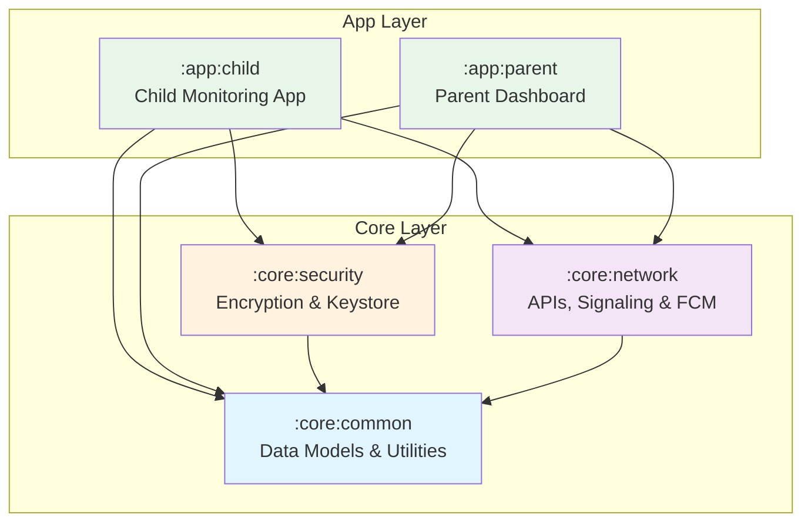
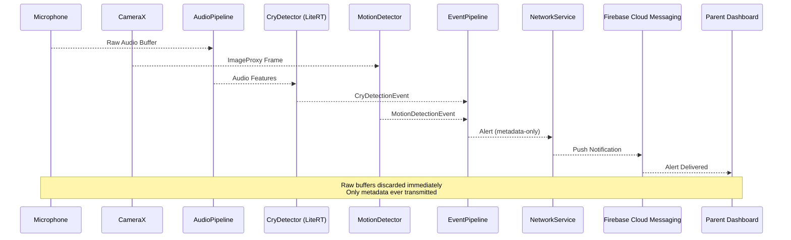
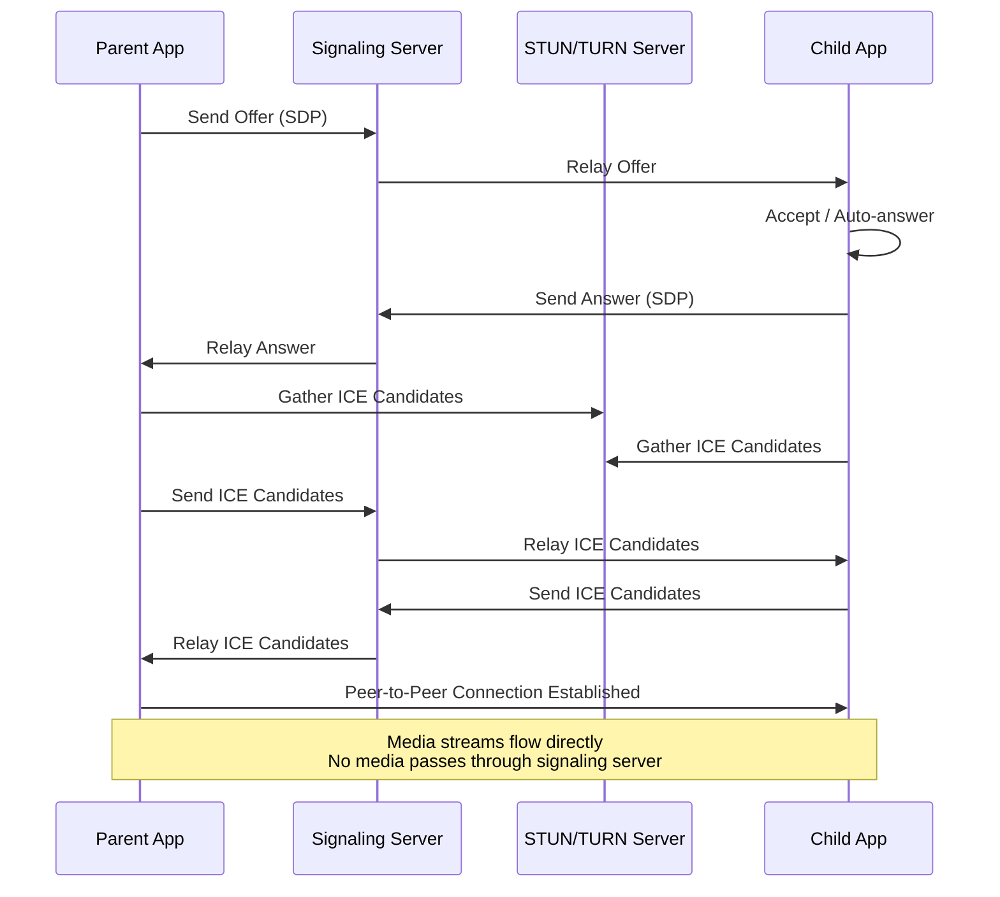

# Privacy-First Child Helper

<p align="center">
  <strong>Android MVP -- A privacy-first child monitoring app with on-device ML detection, WebRTC calling, and zero cloud media storage</strong>
</p>

<p align="center">
  
  
  
  
  
  
</p>

---

## Table of Contents

- [Overview](#overview)
- [Key Features](#key-features)
- [Architecture](#architecture)
- [Tech Stack](#tech-stack)
- [Project Structure](#project-structure)
- [Getting Started](#getting-started)
- [Module Descriptions](#module-descriptions)
- [Privacy & Security](#privacy--security)
- [License](#license)

---

## Overview

**Privacy-First Child Helper** is a dual-app Android ecosystem designed for child safety monitoring with a fundamentally privacy-centric architecture. The system consists of:

- **Child App** (`:app:child`): Runs on the child's device, providing cry detection, motion detection, SOS emergency alerts, and WebRTC calling capabilities.
- **Parent Dashboard** (`:app:parent`): Runs on the parent's device, offering real-time status monitoring, alert history, live video/audio calling, and configuration settings.

### Privacy-First Architecture

Unlike traditional monitoring apps that upload media to the cloud, this app performs **all analysis on-device** using TensorFlow Lite models. Only **metadata-only alerts** (event type, timestamp, confidence score, device status) ever leave the device. No audio recordings, no video clips, no screenshots -- ever.

- **Zero Cloud Media Storage**: Raw audio buffers and camera frames are discarded immediately after on-device ML analysis
- **Peer-to-Peer Calling**: WebRTC calls connect directly between devices -- no media passes through backend servers
- **Encrypted Everything**: Local database uses SQLCipher, settings use Encrypted DataStore, and keys live exclusively in the Android Keystore
- **E2E Pairing**: Devices pair using ECDH key exchange via ephemeral 6-digit pairing codes

---

## Key Features

| Feature | Description |
|---------|-------------|
| **Cry & Motion Detection** | On-device ML detection using LiteRT (TensorFlow Lite). Audio pipeline analyzes microphone input in real-time; CameraX pipeline detects motion through frame analysis. No media is ever recorded or uploaded. |
| **SOS Emergency Button** | Hold-to-activate SOS button on the child app. Sends immediate metadata-only alerts to all paired parent devices via Firebase Cloud Messaging. |
| **WebRTC Video/Audio Calling** | Peer-to-peer video and audio calling between parent and child. Uses the Stream WebRTC Android fork for robust connectivity. Calls auto-answer during Bedtime Mode. |
| **Bedtime Mode** | Calming full-screen UI with dimmed colors. Enables auto-answer for incoming parent calls. Voice prompt manager provides gentle audio feedback. |
| **Parent Dashboard** | Real-time device status card (battery, network, monitor mode), scrollable alert feed, alert history with Room persistence, live video view with two-way talkback, and configurable detection settings. |
| **Privacy-First Design** | Zero cloud media storage. Metadata-only alerts. No MediaRecorder usage. No MediaStore writes. No persistent audio/video files on disk. Android Keystore for key storage. SQLCipher for database encryption. |

---

## Architecture

### Module Dependency Graph



### High-Level Data Flow: Child Device -> Detection -> Alert -> Parent



### WebRTC Calling Flow



---

## Tech Stack

| Technology | Version | Purpose |
|------------|---------|---------|
| **Kotlin** | 2.0.21 | Primary programming language |
| **Jetpack Compose** | BOM 2024.12.01 | Declarative UI framework |
| **Material 3** | BOM 2024.12.01 | Material Design components |
| **Hilt** | 2.54 | Dependency injection |
| **CameraX** | 1.4.1 | Camera preview and image analysis |
| **LiteRT (TensorFlow Lite)** | 1.0.1 | On-device ML inference for cry/motion detection |
| **WebRTC** | 1.3.7 (Stream fork) | Peer-to-peer video/audio calling |
| **Room** | 2.6.1 | Local database with SQLCipher encryption |
| **SQLCipher** | 4.6.1 | Database encryption |
| **Firebase Cloud Messaging** | BOM 33.7.0 | Push notifications for alerts |
| **Android Keystore** | System | Secure cryptographic key storage |
| **Coroutines + Flow** | 1.9.0 | Async programming and reactive streams |
| **kotlinx.serialization** | 1.7.3 | JSON serialization |
| **Retrofit + OkHttp** | 2.11.0 / 4.12.0 | REST API communication |
| **DataStore** | 1.1.1 | Encrypted local preferences |
| **KSP** | 2.0.21-1.0.28 | Kotlin Symbol Processing |

### Build Environment

| Requirement | Version |
|-------------|---------|
| Android Studio | Koala+ (AGP 8.7.3) |
| JDK | 17 |
| Min SDK | 26 (Android 8.0) |
| Target/Compile SDK | 36 (Android 16) |

---

## Project Structure

```
/
|-- gradle/
|   +-- libs.versions.toml         # Centralized dependency version catalog
|
|-- build.gradle.kts               # Root build configuration
|-- settings.gradle.kts            # Module declarations
|
|-- core/
|   |-- common/                    # Shared data models, events & utilities
|   |   |-- build.gradle.kts
|   |   +-- src/main/java/com/childhelper/core/common/
|   |       |-- model/             # Alert, DeviceStatus, PairingSession, etc.
|   |       |-- events/            # App-level event bus
|   |       +-- util/              # CryptoUtil, ResultExt
|   |
|   |-- security/                  # Encryption, Keystore, secure preferences
|   |   |-- build.gradle.kts
|   |   +-- src/main/java/com/childhelper/core/security/
|   |       |-- KeystoreManager.kt
|   |       |-- EncryptionManager.kt
|   |       |-- PairingCrypto.kt
|   |       |-- SecurePreferences.kt
|   |       +-- di/
|   |
|   +-- network/                   # APIs, WebRTC signaling, FCM
|       |-- build.gradle.kts
|       +-- src/main/java/com/childhelper/core/network/
|           |-- api/               # PairingApi, SignalingApi
|           |-- signaling/         # WebRtcSignalingClient, SignalingMessage
|           |-- push/              # FcmService
|           |-- di/
|           +-- util/
|
|-- app/
    |-- child/                     # Child monitoring app
    |   |-- build.gradle.kts
    |   +-- src/main/java/com/childhelper/app/child/
    |       |-- ChildApp.kt
    |       |-- di/
    |       |-- ui/                # Compose screens & ViewModels
    |       |   |-- home/          # ChildHomeScreen, ContactButton
    |       |   |-- sos/           # SosButton, SosManager
    |       |   |-- bedtime/       # BedtimeModeScreen, VoicePromptManager
    |       |   |-- call/          # CallScreen, CallManager
    |       |   |-- detection/     # DetectionOverlay
    |       |   +-- theme/         # ChildTheme, ChildColors
    |       |-- detection/         # CryDetector, MotionDetector, TfliteRunner
    |       |-- service/           # MonitoringService, CallService
    |       +-- res/
    |
    +-- parent/                    # Parent dashboard app
        |-- build.gradle.kts
        +-- src/main/java/com/childhelper/app/parent/
            |-- ParentApp.kt
            |-- di/
            |-- ui/                # Compose screens & ViewModels
            |   |-- dashboard/     # ParentDashboardScreen, DeviceStatusCard, AlertFeed
            |   |-- liveview/      # LiveViewScreen, TalkBackManager
            |   |-- settings/      # SettingsScreen
            |   |-- alerts/        # AlertHistoryScreen
            |   +-- theme/         # ParentTheme, ParentColors
            |-- repository/        # AlertHistoryRepository
            +-- db/                # AppDatabase, AlertDao (Room + SQLCipher)
```

---

## Getting Started

### Prerequisites

- **Android Studio** Koala or newer
- **JDK 17** (configured in Android Studio or via `JAVA_HOME`)
- **Android SDK** with API 36 installed
- A **Firebase project** for Cloud Messaging
- A **signaling server** for WebRTC (configure the base URL)

### Clone and Build

```bash
# Clone the repository
git clone <repository-url>
cd ChildHelper

# Create local.properties
echo "sdk.dir=/path/to/your/Android/Sdk" > local.properties

# Add API base URL
echo "API_BASE_URL=https://your-signaling-server.com" >> local.properties

# Build the project
./gradlew build

# Install child app on child's device
./gradlew :app:child:installDebug

# Install parent app on parent's device
./gradlew :app:parent:installDebug
```

### Firebase Setup

1. Create a new Firebase project at [console.firebase.google.com](https://console.firebase.google.com)
2. Add two Android apps:
   - Package name: `com.childhelper.app.child`
   - Package name: `com.childhelper.app.parent`
3. Download `google-services.json` for each app
4. Place the child app's JSON at:
   ```
   app/child/google-services.json
   ```
5. Place the parent app's JSON at:
   ```
   app/parent/google-services.json
   ```

### Backend API Configuration

Add your signaling server URL to `local.properties`:

```properties
sdk.dir=/path/to/Android/Sdk
API_BASE_URL=https://your-signaling-server.example.com
```

The app uses this base URL for:
- Pairing API (`/api/v1/pairing/*`)
- Signaling API (`/api/v1/signal/*`)
- TURN server credentials (`/api/v1/turn/credentials`)

---

## Build & Deploy

### Prerequisites

- Android Studio Ladybug (2024.2.1) or newer
- JDK 17 (set JAVA_HOME)
- Android SDK API 26-36
- Git for Windows
- 8GB+ RAM, 10GB free disk space

### First-Time Setup (Windows)

```powershell
# 1. Clone
git clone <repo-url>
cd ChildHelper

# 2. Create local.properties from template
copy local.properties.template local.properties
# Edit local.properties with your Android SDK path:
# sdk.dir=C:\Users\YOUR_NAME\AppData\Local\Android\Sdk

# 3. Download Gradle wrapper
.\gradle\wrapper\download-wrapper.bat

# 4. Sync and build
.\gradlew.bat assembleDebug
```

### Build APKs

```powershell
# Child app debug APK
.\gradlew.bat :app:child:assembleDebug

# Parent app debug APK
.\gradlew.bat :app:parent:assembleDebug

# Release APKs (unsigned, requires signing config)
.\gradlew.bat :app:child:assembleRelease
.\gradlew.bat :app:parent:assembleRelease
```

### APK Output Locations

| App | Debug | Release |
|-----|-------|---------|
| Child | `app/child/build/outputs/apk/debug/app-child-debug.apk` | `app/child/build/outputs/apk/release/app-child-release-unsigned.apk` |
| Parent | `app/parent/build/outputs/apk/debug/app-parent-debug.apk` | `app/parent/build/outputs/apk/release/app-parent-release-unsigned.apk` |

### Deploy to Device

```powershell
# Install child app
adb install app/child/build/outputs/apk/debug/app-child-debug.apk

# Install parent app
adb install app/parent/build/outputs/apk/debug/app-parent-debug.apk
```

### Common Windows Build Issues

1. **Gradle wrapper not found**: Run `gradle/wrapper/download-wrapper.bat`
2. **JAVA_HOME not set**: Set environment variable to JDK 17 path
3. **SDK not found**: Check `local.properties` has correct `sdk.dir`
4. **Out of memory**: Increase heap in `gradle.properties`: `org.gradle.jvmargs=-Xmx12g`
5. **Firebase missing**: Add `google-services.json` to `app/child/src/main/` and `app/parent/src/main/`

### For macOS/Linux

Replace `.\gradlew.bat` with `./gradlew` and use forward slashes in paths.

---

## Module Descriptions

### `:core:common`

The foundation module shared by all other modules. Contains all data models (`Alert`, `DeviceStatus`, `PairingSession`, `CryDetectionEvent`, `MotionDetectionEvent`, `SosEvent`, `CallSession`, `Settings`, `Contact`), the `AppEvents` event bus, and utility classes (`CryptoUtil`, `ResultExt`). This module has no internal dependencies and uses `kotlinx.serialization` for model serialization.

### `:core:security`

Handles all cryptographic operations across both apps. Provides `KeystoreManager` for Android Keystore-backed key pairs, `EncryptionManager` for ECDH shared-secret encryption, `PairingCrypto` for generating and verifying pairing codes, and `SecurePreferences` for encrypted DataStore-backed settings storage. Depends on `:core:common` and uses Hilt for DI.

### `:core:network`

Manages all network communication. Contains REST API interfaces (`PairingApi`, `SignalingApi`) built with Retrofit, the `WebRtcSignalingClient` for WebRTC session negotiation, and `FcmService` for Firebase push notifications. Depends on `:core:common` and includes the WebRTC library for signaling integration.

### `:app:child`

The child-facing monitoring application. Features a colorful, child-friendly UI with:
- **Home screen** with large, tappable contact buttons
- **SOS button** with hold-to-activate mechanism
- **Bedtime mode** with calming dark UI and auto-answer calls
- **Call screen** for incoming/outgoing WebRTC calls
- **Detection overlay** showing real-time monitoring status
- Background `MonitoringService` for continuous cry/motion detection using LiteRT models
- `CallService` for persistent call handling

### `:app:parent`

The parent-facing dashboard application. Provides:
- **Dashboard** with real-time device status card and scrolling alert feed
- **Live view** for WebRTC video streaming with two-way talkback
- **Alert history** with Room-persisted, filterable alert log
- **Settings** screen for detection sensitivity, bedtime auto-answer, and retention policies
- Dark/Light theme support with Material 3

---

## Privacy & Security

The app enforces strict privacy guarantees by design:

- **No media is ever recorded** -- `MediaRecorder` is not used anywhere in the codebase
- **No cloud uploads of media** -- raw audio and video buffers are analyzed in memory and immediately discarded
- **No persistent media files** -- `MediaStore` is never written to for audio/video content
- **Metadata-only alerts** -- only event type, timestamp, confidence score, and device status are transmitted
- **Android Keystore** stores all cryptographic keys; no keys are ever in application memory
- **SQLCipher** encrypts all local database content in the parent app
- **Encrypted DataStore** protects all settings and preferences
- **ECDH key exchange** ensures pairing is cryptographically secure via ephemeral 6-digit codes
- **Peer-to-peer WebRTC** ensures call media never passes through backend infrastructure
- **Configurable retention** -- alert history can be set to 24 hours, 7 days, or disabled entirely

---

## License

```
MIT License

Copyright (c) 2025 ChildHelper Contributors

Permission is hereby granted, free of charge, to any person obtaining a copy
of this software and associated documentation files (the "Software"), to deal
in the Software without restriction, including without limitation the rights
to use, copy, modify, merge, publish, distribute, sublicense, and/or sell
copies of the Software, and to permit persons to whom the Software is
furnished to do so, subject to the following conditions:

The above copyright notice and this permission notice shall be included in all
copies or substantial portions of the Software.

THE SOFTWARE IS PROVIDED "AS IS", WITHOUT WARRANTY OF ANY KIND, EXPRESS OR
IMPLIED, INCLUDING BUT NOT LIMITED TO THE WARRANTIES OF MERCHANTABILITY,
FITNESS FOR A PARTICULAR PURPOSE AND NONINFRINGEMENT. IN NO EVENT SHALL THE
AUTHORS OR COPYRIGHT HOLDERS BE LIABLE FOR ANY CLAIM, DAMAGES OR OTHER
LIABILITY, WHETHER IN AN ACTION OF CONTRACT, TORT OR OTHERWISE, ARISING FROM,
OUT OF OR IN CONNECTION WITH THE SOFTWARE OR THE USE OR OTHER DEALINGS IN THE
SOFTWARE.
```

---

<p align="center">
  Built with privacy in mind. No data leaves your devices except what you explicitly allow.
</p>
