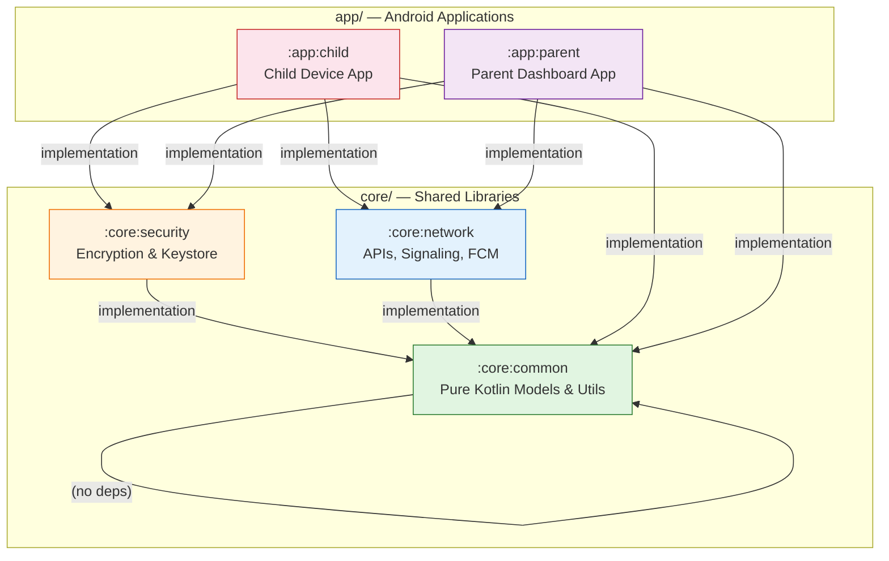
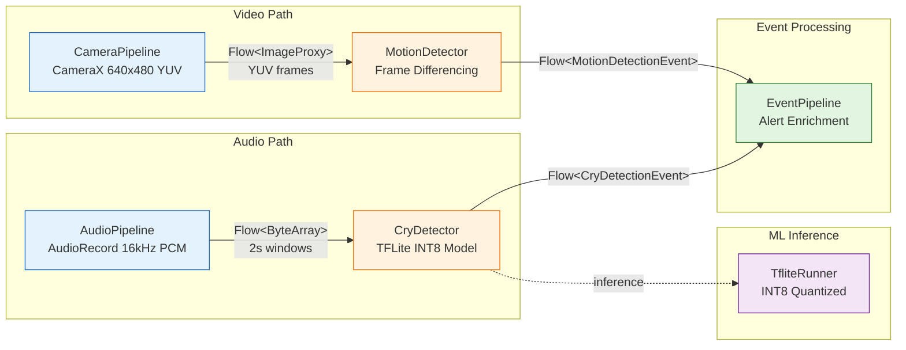
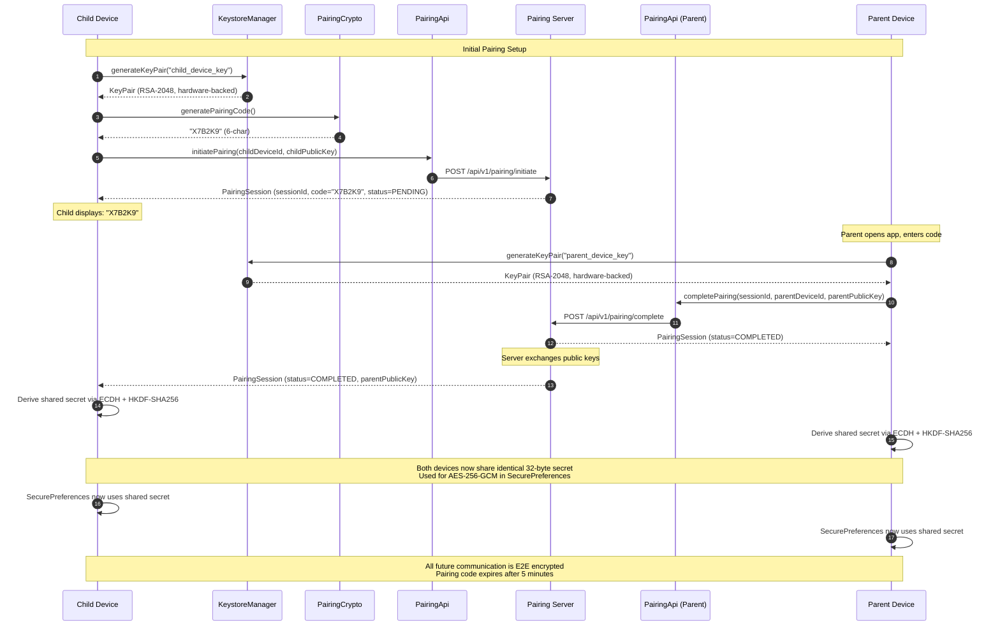
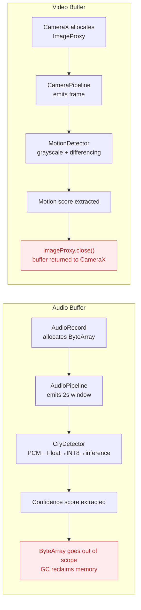
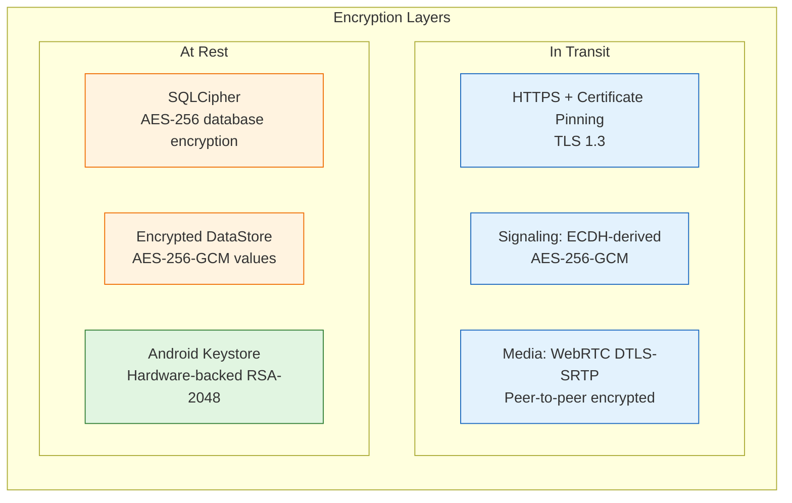
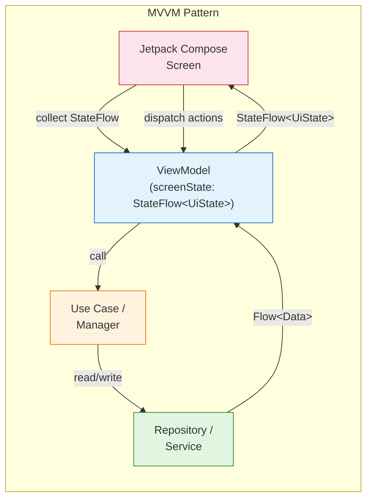

# ARCHITECTURE.md — Privacy-First Child Helper

> Architecture documentation for the Child Helper Android application suite.
> Covers the child monitoring device app (`:app:child`) and the parent guardian
dashboard app (`:app:parent`), built with Clean Architecture, MVVM, and a
multi-module Gradle project structure.

---

## Table of Contents

1. [Architecture Overview](#1-architecture-overview)
2. [Module Breakdown](#2-module-breakdown)
   - [`:core:common`](#corecommon)
   - [`:core:security`](#coresecurity)
   - [`:core:network`](#corenetwork)
   - [`:app:child`](#appchild)
   - [`:app:parent`](#appparent)
3. [Data Flow Diagrams](#3-data-flow-diagrams)
4. [Privacy Architecture](#4-privacy-architecture)
5. [Threading Model](#5-threading-model)
6. [State Management](#6-state-management)

---

## 1. Architecture Overview

### Design Principles

The architecture is built on **Clean Architecture** principles with the **MVVM (Model-View-ViewModel)** presentation pattern. The codebase is organized as a **multi-module Gradle project** that enforces strict separation of concerns through module boundaries and unidirectional dependencies.

| Principle | Implementation |
|-----------|---------------|
| **Separation of Concerns** | Each module has a single, well-defined responsibility |
| **Dependency Inversion** | Core modules define interfaces; app modules provide implementations |
| **Unidirectional Dependencies** | DAG module graph — core modules never depend on app modules |
| **Privacy by Design** | Zero cloud media storage; metadata-only alerts; ephemeral buffers |
| **Testability** | Interfaces + Hilt DI enable easy mocking for unit tests |

### Module Dependency Graph

The project contains **five modules** arranged as a Directed Acyclic Graph (DAG) with no circular dependencies:



### Dependency Rules

| From Module | Depends On | Rule |
|-------------|-----------|------|
| `:app:child` | `:core:common`, `:core:security`, `:core:network` | Child app consumes all core modules |
| `:app:parent` | `:core:common`, `:core:security`, `:core:network` | Parent app consumes all core modules |
| `:core:security` | `:core:common` | Security uses common models and `CryptoUtil` |
| `:core:network` | `:core:common` | Network uses common models for serialization |
| `:core:common` | — | **Zero Android framework dependencies** (pure Kotlin) |

### High-Level Component Diagram

```mermaid
graph TB
    subgraph "Child Device (:app:child)"
        UI_CH[Jetpack Compose UI]
        VM_CH[ViewModels<br/>StateFlow]
        DET[Detection Pipeline<br/>Cry | Motion]
        CM[CallManager<br/>WebRTC]
        MS[MonitoringService<br/>Foreground]
    end

    subgraph "Parent Device (:app:parent)"
        UI_PA[Jetpack Compose UI]
        VM_PA[ViewModels<br/>StateFlow]
        ALERTS[AlertHistoryRepository]
        DB[(SQLCipher<br/>Room DB)]
        LV[LiveView + TalkBack]
    end

    subgraph "Core Layer"
        API[PairingApi + SignalingApi]
        SIG[WebRtcSignalingClient]
        FCM[FcmService]
        ENC[EncryptionManager<br/>AES-256-GCM]
        KS[KeystoreManager<br/>RSA-2048]
        PREFS[SecurePreferences<br/>DataStore]
    end

    subgraph "External"
        FB[Firebase Cloud Messaging]
        API_SRV[Backend API Server]
        TURN[TURN/STUN Servers]
    end

    DET -->|"Flow<CryDetectionEvent>"| VM_CH
    DET -->|"Flow<MotionDetectionEvent>"| VM_CH
    CM -->|"StateFlow<CallState>"| VM_CH
    VM_CH --> UI_CH
    MS --> DET

    VM_PA --> UI_PA
    ALERTS --> DB
    VM_PA --> ALERTS
    LV --> CM

    DET -->|"metadata-only Alert"| FCM
    FCM --> FB
    FB --> FCM
    SIG --> API
    API --> API_SRV
    CM --> SIG
    LV --> SIG
    ENC --> KS
    PREFS --> ENC

    style FB fill:#ffebee,stroke:#c62828
    style API_SRV fill:#ffebee,stroke:#c62828
    style TURN fill:#ffebee,stroke:#c62828
```

---

## 2. Module Breakdown

---

### `:core:common`

> **Responsibility:** Domain models, application events, and pure Kotlin utilities.
> **Key Constraint:** Zero Android framework dependencies — this module is pure Kotlin
> with only `kotlinx-serialization` and `kotlinx-coroutines-core`.

#### Package Structure

```
:core:common
└── src/main/java/com/childhelper/core/common/
    ├── model/          # All data models
    ├── events/         # AppEvent sealed class
    └── util/           # Pure Kotlin utilities
```

#### Data Models

All models are annotated with `@Serializable` for `kotlinx.serialization`:

| Model | Key Fields | Purpose |
|-------|-----------|---------|
| **`Alert`** | `id: String`, `eventType: AlertType`, `timestamp: Long`, `confidence: Float?`, `deviceStatus: DeviceStatusSnapshot`, `childDeviceId: String` | Metadata-only alert emitted to guardians |
| **`DeviceStatus`** | `deviceId: String`, `isOnline: Boolean`, `batteryPercent: Int`, `isCharging: Boolean`, `networkType: String`, `monitorMode: MonitorMode`, `lastSeen: Long` | Full device telemetry |
| **`DeviceStatusSnapshot`** | `batteryPercent: Int`, `isCharging: Boolean`, `networkType: String`, `monitorMode: MonitorMode` | Condensed status embedded in every alert |
| **`PairingSession`** | `sessionId: String`, `pairingCode: String` (6-char), `childDeviceId: String`, `parentDeviceId: String?`, `childPublicKey: String?`, `parentPublicKey: String?`, `status: PairingStatus`, `createdAt: Long`, `expiresAt: Long` (+5 min) | Device pairing state |
| **`Contact`** | `id: String`, `name: String`, `role: ContactRole`, `photoUri: String?`, `phoneNumber: String?`, `isPrimary: Boolean` | Guardian contact info |
| **`SosEvent`** | `id: String`, `timestamp: Long`, `location: GeoLocation?`, `childDeviceId: String` | SOS button activation |
| **`CryDetectionEvent`** | `id: String`, `timestamp: Long`, `confidence: Float`, `consecutiveWindows: Int`, `childDeviceId: String` | Cry detection result |
| **`MotionDetectionEvent`** | `id: String`, `timestamp: Long`, `confidence: Float`, `consecutiveFrames: Int`, `childDeviceId: String` | Motion detection result |
| **`DetectionConfig`** | `sensitivity: SensitivityLevel`, `cryEnabled: Boolean`, `motionEnabled: Boolean`, `cryThreshold: Float` (0.7), `motionThreshold: Float` (0.15), `cryConsecutiveWindows: Int` (3), `motionConsecutiveFrames: Int` (2), `alertHistoryRetention: RetentionPeriod` | Detection pipeline tuning |
| **`CallSession`** | `sessionId: String`, `callerId: String`, `calleeId: String`, `status: CallStatus`, `startTime: Long?`, `endTime: Long?`, `isAutoAnswer: Boolean`, `hasVideo: Boolean` | Active call state |
| **`AppSettings`** | `cryDetectionEnabled: Boolean`, `motionDetectionEnabled: Boolean`, `sensitivity: SensitivityLevel`, `bedtimeAutoAnswer: Boolean`, `alertHistoryRetention: RetentionPeriod`, `sosEscalationOrder: List<String>`, `locationSharingEnabled: Boolean`, `pushNotificationsEnabled: Boolean` | User-configurable app settings |

#### Enumerations

```kotlin
enum class AlertType {
    CRY_DETECTED, MOTION_DETECTED, SOS_ACTIVATED,
    CAMERA_OBSTRUCTED, DEVICE_OFFLINE, LOW_BATTERY,
    CALL_STARTED, CALL_ENDED
}

enum class MonitorMode { IDLE, BEDTIME, CALLING, SOS }
enum class PairingStatus { PENDING, COMPLETED, REVOKED, EXPIRED }
enum class ContactRole { MOTHER, FATHER, GUARDIAN }
enum class SensitivityLevel { LOW, NORMAL, HIGH }
enum class RetentionPeriod { OFF, TWENTY_FOUR_HOURS, SEVEN_DAYS }
enum class CallStatus { CONNECTING, RINGING, CONNECTED, ENDED, FAILED }
```

#### Event System (`AppEvent`)

A sealed class providing decoupled, type-safe application-wide event broadcasting:

```kotlin
sealed class AppEvent {
    data class AlertReceived(val alert: Alert) : AppEvent()
    data class DeviceStatusChanged(val deviceId: String, val status: DeviceStatus) : AppEvent()
    data class PairingStateChanged(val session: PairingSession) : AppEvent()
    data class CallStateChanged(val session: CallSession) : AppEvent()
    data class PushTokenRefreshed(val token: String) : AppEvent()
    data class LiveViewRequested(val childDeviceId: String) : AppEvent()
    data class NetworkAvailabilityChanged(val isAvailable: Boolean) : AppEvent()
    data class LowBatteryWarning(val deviceId: String, val batteryPercent: Int) : AppEvent()
}

typealias AppEventBus = SharedFlow<AppEvent>
```

#### Utility Classes

**`SafeResult<T>`** — A privacy-safe result type replacing Kotlin's `Result`:

```kotlin
sealed class SafeResult<out T> {
    data class Success<T>(val data: T) : SafeResult<T>()
    data class Failure(val error: String, val code: ErrorCode = ErrorCode.UNKNOWN) : SafeResult<Nothing>()

    fun getOrNull(): T?
    fun <R> map(transform: (T) -> R): SafeResult<R>
    inline fun <R> flatMap(transform: (T) -> SafeResult<R>): SafeResult<R>
    inline fun onSuccess(action: (T) -> Unit): SafeResult<T>
    inline fun onFailure(action: (Failure) -> Unit): SafeResult<T>
}
```

Error codes: `UNKNOWN`, `KEYSTORE_ERROR`, `ENCRYPTION_ERROR`, `NETWORK_ERROR`, `SERVER_ERROR`, `PAIRING_ERROR`, `CALL_ERROR`, `DETECTION_ERROR`, `PERMISSION_DENIED`, `INVALID_ARGUMENT`

**`CryptoUtil`** — Pure, side-effect-free cryptographic helper functions:

| Function | Purpose |
|----------|---------|
| `secureRandomBytes(length: Int)` | CSPRNG byte generation via `SecureRandom` |
| `generatePairingCode()` | 6-character code (excludes I, O, 0, 1) |
| `sha256(data: ByteArray)` | SHA-256 digest |
| `base64Encode(bytes: ByteArray)` / `base64Decode(encoded: String)` | URL-safe Base64 with padding handling |
| `fingerprintPublicKey(publicKeyBytes: ByteArray)` | 8-char hex fingerprint for MITM detection |
| `constantTimeEquals(a: ByteArray, b: ByteArray)` | Timing-attack-resistant comparison |

---

### `:core:security`

> **Responsibility:** All cryptographic operations, key management, and encrypted storage.
> **Key Constraint:** All private key material lives exclusively in Android Keystore.

#### Package Structure

```
:core:security
└── src/main/java/com/childhelper/core/security/
    ├── KeystoreManager.kt        # Android Keystore integration
    ├── EncryptionManager.kt      # AES-256-GCM + ECDH/HKDF
    ├── PairingCrypto.kt          # Pairing code generation & verification
    ├── SecurePreferences.kt      # Encrypted DataStore
    └── di/
        └── SecurityModule.kt     # Hilt bindings
```

#### KeystoreManager

Manages asymmetric cryptographic keys inside the Android Keystore:

```kotlin
interface KeystoreManager {
    fun generateKeyPair(alias: String): KeyPair          // RSA-2048, hardware-backed
    fun getPublicKey(alias: String): PublicKey?          // Retrieve public key
    fun decrypt(alias: String, encryptedData: ByteArray): ByteArray
    fun encrypt(alias: String, plainData: ByteArray): ByteArray
    fun removeKey(alias: String)                         // Irreversible deletion
}
```

**Implementation details (`KeystoreManagerImpl`):**
- Algorithm: **RSA-2048** with `RSA/ECB/PKCS1Padding`
- Key generation uses `KeyGenParameterSpec` with `KeyProperties`
- **StrongBox** preferred (dedicated secure hardware, API 28+), **TEE** fallback
- Private keys never leave the Keystore boundary
- `InvalidKeyException` thrown for missing keys

#### EncryptionManager

Provides symmetric encryption using secrets derived from ECDH key agreement:

```kotlin
interface EncryptionManager {
    fun encryptWithSharedSecret(plainText: String, sharedSecret: ByteArray): String   // AES-256-GCM
    fun decryptWithSharedSecret(cipherText: String, sharedSecret: ByteArray): String   // AES-256-GCM
    fun generateSharedSecret(privateKey: PrivateKey, publicKey: PublicKey): ByteArray  // ECDH + HKDF-SHA256
}
```

**Implementation details (`EncryptionManagerImpl`):**
- **AES-256-GCM**: Random 12-byte IV per operation, 128-bit auth tag
- **Key format**: `base64(iv + ciphertext + auth_tag)`
- **Key derivation**: `ECDH → HKDF-SHA256(extract → expand) → 32-byte AES key`
- HKDF info string: `"ChildHelper-v1"` (domain separation)
- All JCA/JCE standard providers — no custom crypto

#### PairingCrypto

Cryptographic operations for the device pairing flow:

```kotlin
interface PairingCrypto {
    fun generatePairingCode(): String                                           // 6-char alphanumeric
    fun deriveSharedSecret(childKeyPair: KeyPair, parentPublicKey: PublicKey): ByteArray
    fun verifyPairingCode(code: String, session: PairingSession): Boolean       // Constant-time
}
```

**Pairing code properties:**
- Character set: `A-H, J-N, P-Z, 2-9` (32 chars, excludes I, O, 0, 1)
- Entropy: ~1 billion combinations (32^6)
- Lifetime: 5 minutes (`expiresAt = createdAt + 5 * 60 * 1000`)
- **Constant-time verification** via `CryptoUtil.constantTimeEquals()` to prevent timing attacks

#### SecurePreferences

Encrypted key-value storage backed by Jetpack DataStore:

```kotlin
interface SecurePreferences {
    suspend fun putString(key: String, value: String)
    suspend fun getString(key: String, default: String? = null): String?
    suspend fun putBoolean(key: String, value: Boolean)
    suspend fun getBoolean(key: String, default: Boolean = false): Boolean
    suspend fun remove(key: String)
    suspend fun clear()
}
```

**Two implementations:**

| Implementation | Encryption | Use Case |
|---------------|------------|----------|
| `SecurePreferencesImpl` | AES-256-GCM via `EncryptionManager` | **Post-pairing** — all data encrypted with shared secret |
| `UnpairedSecurePreferences` | None (plaintext) | **Pre-pairing** — only device ID and pairing state |

**Features of `SecurePreferencesImpl`:**
- In-memory read cache with `Mutex`-protected invalidation
- Values encrypted before write, decrypted after read
- Keys stored in plaintext (not sensitive); values encrypted
- No cloud backup

#### DI Module (`SecurityModule`)

```kotlin
@Module
@InstallIn(SingletonComponent::class)
class SecurityModule {

    @Provides @Singleton
    fun provideKeystoreManager(): KeystoreManager

    @Provides @Singleton
    fun provideEncryptionManager(): EncryptionManager

    @Provides @Singleton
    fun providePairingCrypto(encryptionManager: EncryptionManager): PairingCrypto

    @Provides @Singleton
    fun provideUnpairedSecurePreferences(@ApplicationContext context: Context): SecurePreferences

    @Provides @Singleton @PairedSecurePrefs
    fun provideSecurePreferencesImpl(...): SecurePreferences
}

@Qualifier @Retention(AnnotationRetention.BINARY) annotation class PairedSecurePrefs
@Qualifier @Retention(AnnotationRetention.BINARY) annotation class UnpairedSecurePrefs
```

**Scoping:** All security dependencies are `@Singleton` to ensure:
- Single Keystore instance throughout the app
- Shared `EncryptionManager` (stateless, thread-safe)
- Consistent DataStore file access

---

### `:core:network`

> **Responsibility:** REST API communication, WebRTC signaling, Firebase Cloud Messaging,
> and network utilities.

#### Package Structure

```
:core:network
└── src/main/java/com/childhelper/core/network/
    ├── api/
    │   ├── PairingApi.kt              # Device pairing REST endpoints
    │   └── SignalingApi.kt            # WebRTC signaling REST endpoints
    ├── signaling/
    │   ├── WebRtcSignalingClient.kt   # Signaling message Flow + polling
    │   └── SignalingMessage.kt        # Sealed class message types
    ├── push/
    │   └── FcmService.kt              # Firebase Cloud Messaging service
    ├── di/
    │   └── NetworkModule.kt           # Hilt bindings (Retrofit, OkHttp)
    └── util/
        └── NetworkUtil.kt             # ConnectivityManager wrapper
```

#### PairingApi

REST endpoints for the device pairing lifecycle:

```kotlin
interface PairingApi {
    @POST("/api/v1/pairing/initiate")
    suspend fun initiatePairing(@Body request: InitiatePairingRequest): PairingSession

    @POST("/api/v1/pairing/complete")
    suspend fun completePairing(@Body request: CompletePairingRequest): PairingSession

    @POST("/api/v1/pairing/revoke")
    suspend fun revokePairing(@Body request: RevokePairingRequest)

    @GET("/api/v1/pairing/status/{sessionId}")
    suspend fun getPairingStatus(@Path("sessionId") sessionId: String): PairingSession

    @POST("/api/v1/turn/credentials")
    suspend fun getTurnCredentials(): TurnCredentials
}
```

**Request/Response models:**

```kotlin
data class InitiatePairingRequest(val childDeviceId: String, val childPublicKey: String)
data class CompletePairingRequest(val sessionId: String, val parentDeviceId: String, val parentPublicKey: String)
data class RevokePairingRequest(val sessionId: String, val deviceId: String)
data class TurnCredentials(val username: String, val password: String, val urls: List<String>)
```

#### SignalingApi

REST endpoints for WebRTC signaling message exchange:

```kotlin
interface SignalingApi {
    @POST("/api/v1/signal/offer")    suspend fun sendOffer(@Body offer: SdpMessage)
    @POST("/api/v1/signal/answer")   suspend fun sendAnswer(@Body answer: SdpMessage)
    @POST("/api/v1/signal/ice")      suspend fun sendIceCandidate(@Body candidate: IceMessage)
    @GET("/api/v1/signal/pending/{deviceId}")
    suspend fun getPendingMessages(@Path("deviceId") deviceId: String): List<SignalingMessage>
}
```

#### WebRtcSignalingClient

`@Singleton` class managing the full WebRTC signaling lifecycle:

```kotlin
@Singleton
class WebRtcSignalingClient @Inject constructor(
    private val signalingApi: SignalingApi,
    private val deviceIdProvider: () -> String
)
```

**Key features:**
- **Incoming message Flows** (filtered by type):
  - `incomingOffers: Flow<SdpMessage>` — SDP offer messages
  - `incomingAnswers: Flow<SdpMessage>` — SDP answer messages
  - `incomingIceCandidates: Flow<IceMessage>` — ICE candidate messages
  - `incomingHangUps: Flow<HangUpMessage>` — Session termination
- **Polling mechanism**: Configurable interval (default 2000ms) on `Dispatchers.IO`
- **Immediate poll**: `pollNow()` for push-triggered message retrieval
- **Privacy**: Transmits **ONLY** SDP/ICE metadata — **no media payload**

**SignalingMessage hierarchy:**

```kotlin
@Serializable sealed class SignalingMessage {
    abstract val messageId: String
    abstract val fromDeviceId: String
    abstract val toDeviceId: String
    abstract val timestamp: Long
    abstract val sessionId: String
}

@Serializable data class SdpMessage(..., val type: SdpType, val sdp: String) : SignalingMessage()
@Serializable data class IceMessage(..., val candidate: String, val sdpMLineIndex: Int, val sdpMid: String) : SignalingMessage()
@Serializable data class HangUpMessage(..., val reason: HangUpReason) : SignalingMessage()
@Serializable data class PingMessage(...) : SignalingMessage()
@Serializable data class PongMessage(..., val rttMs: Long?) : SignalingMessage()
```

#### FcmService

`FirebaseMessagingService` receiving push notifications with **metadata-only payloads**:

```kotlin
@AndroidEntryPoint
class FcmService : FirebaseMessagingService() {
    @Inject lateinit var signalingClient: WebRtcSignalingClient

    // Parsed alert emissions
    companion object {
        val alertFlow: SharedFlow<Alert> = _alertFlow.asSharedFlow()
    }
}
```

**Handled message types:**
| FCM Data `type` | Action |
|----------------|--------|
| `signal_poll` | Triggers `signalingClient.pollNow()` |
| `CRY_DETECTED` | Parses and emits `Alert` via `alertFlow` |
| `MOTION_DETECTED` | Parses and emits `Alert` via `alertFlow` |
| `SOS_ACTIVATED` | Parses and emits high-priority `Alert` |
| `CAMERA_OBSTRUCTED` | Parses and emits `Alert` |
| `DEVICE_OFFLINE` | Parses and emits `Alert` |
| `LOW_BATTERY` | Parses and emits `Alert` |

**Privacy guarantee**: FCM payloads contain **only** `eventType`, `timestamp`, `confidence`, and `deviceStatus` fields. **No audio, video, or image data ever passes through Firebase.**

#### NetworkModule

Hilt module wiring Retrofit, OkHttp, and APIs as `@Singleton`:

| Dependency | Configuration |
|-----------|--------------|
| `Json` (kotlinx.serialization) | `ignoreUnknownKeys = true`, `isLenient = true`, `encodeDefaults = true`, `explicitNulls = false` |
| `OkHttpClient` | Connect: 15s, Read/Write: 30s, retry on failure, **certificate pinning** |
| Certificate Pinning | Pinned SHA-256 hash for pairing/signaling API domain |
| `Retrofit` | Base URL from `BuildConfig.API_BASE_URL`, kotlinx.serialization converter |
| Debug logging | `HttpLoggingInterceptor(Level.BODY)` — **debug builds only** |

---

### `:app:child`

> **Responsibility:** The child-facing app that runs on the monitoring device.
> Provides cry/motion detection, SOS, bedtime mode, video calling, and foreground monitoring.

#### Package Structure

```
:app:child
└── src/main/java/com/childhelper/app/child/
    ├── ChildApp.kt                          # Application class (@HiltAndroidApp)
    ├── di/
    │   └── ChildAppModule.kt                # @ChildScope, pipeline bindings
    ├── ui/
    │   ├── home/                            # ChildHomeScreen, ViewModel, ContactButton
    │   ├── sos/                             # SosButton, SosManager, ViewModel
    │   ├── bedtime/                         # BedtimeModeScreen, ViewModel, VoicePromptManager
    │   ├── call/                            # CallScreen, CallManager, ViewModel
    │   ├── detection/                       # DetectionOverlay, ViewModel
    │   └── theme/                           # ChildTheme, ChildColors
    ├── detection/                           # Detection pipeline components
    │   ├── CryDetector.kt
    │   ├── MotionDetector.kt
    │   ├── AudioPipeline.kt
    │   ├── CameraPipeline.kt
    │   ├── EventPipeline.kt
    │   └── TfliteRunner.kt
    └── service/
        ├── MonitoringService.kt             # Foreground service
        └── CallService.kt                   # Call foreground service
```

#### UI Layer

| Screen | Key Components | Description |
|--------|---------------|-------------|
| **Home** | `ChildHomeScreen`, `ChildHomeViewModel`, `ContactButton` | Main screen with large tap-to-call guardian buttons |
| **SOS** | `SosButton`, `SosManager`, `SosViewModel` | Emergency button with escalation order |
| **Bedtime** | `BedtimeModeScreen`, `BedtimeViewModel`, `VoicePromptManager` | Sleep monitoring mode with voice prompts (TTS) |
| **Call** | `CallScreen`, `CallViewModel` | Active call UI with video/audio controls |
| **Detection Overlay** | `DetectionOverlay`, `DetectionViewModel` | Visual indicator when monitoring is active |

#### Detection Pipeline

The detection pipeline runs inside `MonitoringService` (foreground) and consists of six coordinated components:



**AudioPipeline:**
- Uses `AudioRecord` (**NOT** `MediaRecorder`) for raw buffer access
- 16kHz mono, 16-bit PCM
- Emits 2-second windows (64000 bytes) as `Flow<ByteArray>`
- Buffers are copied then immediately discarded after emission

**CameraPipeline:**
- Uses CameraX `ImageAnalysis` (**NOT** video recording)
- Resolution: 640x480, format YUV_420_888
- Back camera for room monitoring
- Emits `Flow<ImageProxy>` with `STRATEGY_KEEP_ONLY_LATEST`
- Includes **camera obstruction detection** (10+ consecutive dark frames triggers `CAMERA_OBSTRUCTED` alert)
- All frames closed via `imageProxy.close()` after processing

**CryDetector:**
- Pipeline: PCM → float normalization → INT8 quantization → TFLite inference → softmax/sigmoid → sustained-confidence logic
- Default threshold: **0.70** confidence
- Requires **3 consecutive positive windows** to trigger (configurable)
- Emits `CryDetectionEvent` with confidence and consecutive count

**MotionDetector:**
- Pipeline: ImageProxy → 320x240 grayscale → pixel-wise frame differencing → threshold logic
- Samples every 4th pixel for performance
- Default threshold: **15% changed pixels** (0.15)
- Requires **2 consecutive motion frames** to trigger (configurable)
- Resets state on camera obstruction events

**TfliteRunner:**
- Generic LiteRT (TensorFlow Lite) runner with `@Singleton` scoping
- Loads quantized INT8 model from assets (default: `cry_detect_model.tflite`)
- Thread-safe with `Mutex`-protected inference
- XNNPACK delegate enabled, 2 threads
- Runs on `Dispatchers.Default`

**EventPipeline:**
- Central collector for all detection events
- Enriches events with `DeviceStatusSnapshot` (battery, charging, network, monitor mode)
- Emits `Alert` objects as `Flow<Alert>` with `DROP_OLDEST` overflow policy
- Routes to FCM for guardian notification
- Handles: cry, motion, SOS, obstruction, offline, low battery, call started/ended

#### WebRTC — CallManager

`@Singleton` class managing WebRTC peer-to-peer video/audio calls:

```kotlin
@Singleton
class CallManager @Inject constructor(
    @ApplicationContext private val context: Context,
    private val signalingClient: WebRtcSignalingClient,
    private val securePreferences: SecurePreferences,
    private val scope: CoroutineScope
)
```

**Key features:**
- **One-tap calling** to guardians from home screen
- **WebRTC video + audio** with peer connection
- **Audio-only fallback** when camera unavailable
- **Call state machine**: `Idle → Connecting → Ringing → Connected → Ended`
- **Talk-back** (half-duplex voice) via `enableTalkBack(enabled)`
- **Camera switching** and mute/video toggle during call

**Call state sealed class:**

```kotlin
sealed class CallState {
    data object Idle : CallState()
    data class Connecting(val sessionId: String) : CallState()
    data class Ringing(val sessionId: String) : CallState()
    data class Incoming(val sessionId: String, val callerName: String) : CallState()
    data class Connected(val sessionId: String) : CallState()
    data class Ended(val sessionId: String) : CallState()
    data class Error(val message: String) : CallState()
}
```

#### Services

**MonitoringService** (`Service` + `LifecycleOwner`):
- Runs as **foreground service** with persistent notification
- Foreground types: `FOREGROUND_SERVICE_TYPE_CAMERA | FOREGROUND_SERVICE_TYPE_MICROPHONE` (API 34+)
- Acquires partial wake lock for continuous monitoring
- Manages `CryDetector` and `MotionDetector` lifecycles
- Battery monitoring every 5 minutes (alerts below 20% and 10%)
- Actions: `START_MONITORING`, `STOP_MONITORING`, `UPDATE_CONFIG`
- Returns `START_STICKY` for auto-restart
- Creates 4 notification channels: Monitoring, Alerts, Calls, SOS

**CallService:**
- Foreground service for active calls
- Maintains call notification with end-call action

#### DI Module (`ChildAppModule`)

```kotlin
@Module
@InstallIn(SingletonComponent::class)
object ChildAppModule {

    @Provides @Singleton @ChildScope
    fun provideChildCoroutineScope(): CoroutineScope =
        CoroutineScope(SupervisorJob() + Dispatchers.Default)

    // Detection pipeline (all @Singleton, injected with @ChildScope)
    fun provideAudioPipeline(context, @ChildScope scope): AudioPipeline
    fun provideCameraPipeline(context, @ChildScope scope): CameraPipeline
    fun provideCryDetector(audioPipeline, tfliteRunner, @ChildScope scope): CryDetector
    fun provideMotionDetector(cameraPipeline, securePreferences, @ChildScope scope): MotionDetector
    fun provideEventPipeline(context, securePreferences, @ChildScope scope): EventPipeline

    // UI managers
    fun provideSosManager(context, eventPipeline, @ChildScope scope): SosManager
    fun provideVoicePromptManager(context): VoicePromptManager
    fun provideCallManager(context, signalingClient, securePreferences, @ChildScope scope): CallManager
}
```

The `@ChildScope` qualifier provides a dedicated `CoroutineScope(SupervisorJob() + Dispatchers.Default)` for the detection pipeline, ensuring that a failure in one detector does not cascade to others.

---

### `:app:parent`

> **Responsibility:** The parent/guardian dashboard app for monitoring the child device,
> viewing alert history, receiving live video, and managing settings.

#### Package Structure

```
:app:parent
└── src/main/java/com/childhelper/app/parent/
    ├── ParentApp.kt                           # Application class (@HiltAndroidApp)
    ├── di/
    │   └── ParentAppModule.kt                 # DB, repository, DataStore bindings
    ├── ui/
    │   ├── dashboard/                         # ParentDashboardScreen, ViewModel, DeviceStatusCard, AlertFeed
    │   ├── liveview/                          # LiveViewScreen, ViewModel, TalkBackManager
    │   ├── settings/                          # SettingsScreen, ViewModel
    │   ├── alerts/                            # AlertHistoryScreen, ViewModel
    │   └── theme/                             # ParentTheme, ParentColors
    ├── repository/
    │   └── AlertHistoryRepository.kt          # Alert history with retention
    └── db/
        ├── AppDatabase.kt                     # Room + SQLCipher
        ├── AlertDao.kt                        # Room DAO
        └── AlertEntity.kt                     # Room entity (metadata only)
```

#### UI Layer

| Screen | Key Components | Description |
|--------|---------------|-------------|
| **Dashboard** | `ParentDashboardScreen`, `ParentDashboardViewModel`, `DeviceStatusCard`, `AlertFeed` | Main screen showing device status and recent alerts |
| **Live View** | `LiveViewScreen`, `LiveViewViewModel`, `TalkBackManager` | Real-time video from child device with two-way audio |
| **Settings** | `SettingsScreen`, `SettingsViewModel` | Detection config, retention, notification preferences |
| **Alert History** | `AlertHistoryScreen`, `AlertHistoryViewModel` | Filterable, searchable history of all alerts |

#### Data Layer

**AppDatabase (Room + SQLCipher):**

```kotlin
@Database(entities = [AlertEntity::class], version = 1, exportSchema = true)
abstract class AppDatabase : RoomDatabase() {
    abstract fun alertDao(): AlertDao

    companion object {
        fun create(context: Context, passphrase: ByteArray): AppDatabase {
            val factory = SupportFactory(passphrase)
            return Room.databaseBuilder(context, AppDatabase::class.java, "parent_alerts.db")
                .openHelperFactory(factory)
                .fallbackToDestructiveMigration()
                .build()
        }

        fun generatePassphrase(): ByteArray = ByteArray(32).apply { SecureRandom().nextBytes(this) }
    }
}
```

- Passphrase retrieved from `SecurePreferences` (generated once, stored securely)
- 32-byte random passphrase for SQLCipher AES-256 encryption
- Single entity: `AlertEntity` (metadata only)

**AlertEntity** — stores only metadata fields:

```kotlin
@Entity(tableName = "alerts", indices = [Index("timestamp"), Index("eventType"), Index("childDeviceId")])
data class AlertEntity(
    @PrimaryKey val id: String,
    val eventType: String,          // AlertType.name
    val timestamp: Long,
    val confidence: Float?,
    val childDeviceId: String,
    val batteryPercent: Int,        // Snapshot at alert time
    val isCharging: Boolean,
    val networkType: String,
    val monitorMode: String
)
```

**AlertDao** — Room DAO with Flow-based reactive queries:

```kotlin
@Dao
interface AlertDao {
    @Insert(onConflict = OnConflictStrategy.REPLACE) suspend fun insert(alert: AlertEntity): Long
    @Insert(onConflict = OnConflictStrategy.REPLACE) suspend fun insertAll(alerts: List<AlertEntity>)

    @Query("SELECT * FROM alerts ORDER BY timestamp DESC") fun getAllAlerts(): Flow<List<AlertEntity>>
    @Query("SELECT * FROM alerts WHERE eventType = :eventType ORDER BY timestamp DESC") fun getAlertsByType(eventType: String): Flow<List<AlertEntity>>
    @Query("SELECT * FROM alerts WHERE timestamp >= :startTime AND timestamp <= :endTime ORDER BY timestamp DESC") fun getAlertsByDateRange(startTime: Long, endTime: Long): Flow<List<AlertEntity>>
    @Query("SELECT * FROM alerts ORDER BY timestamp DESC LIMIT :limit") fun getRecentAlerts(limit: Int): Flow<List<AlertEntity>>
    @Query("SELECT COUNT(*) FROM alerts") fun getAlertCount(): Flow<Int>

    @Query("DELETE FROM alerts WHERE timestamp < :olderThan") suspend fun deleteOlderThan(olderThan: Long): Int
    @Query("DELETE FROM alerts") suspend fun deleteAll(): Int
    @Query("DELETE FROM alerts WHERE id = :alertId") suspend fun deleteById(alertId: String): Int
}
```

#### Repository — AlertHistoryRepository

`@Singleton` repository enforcing retention policies:

```kotlin
@Singleton
class AlertHistoryRepository @Inject constructor(
    private val alertDao: AlertDao,
    private val dataStore: DataStore<Preferences>
)
```

**Retention policy:**

| Setting | Max Age | Behavior |
|---------|---------|----------|
| `RetentionPeriod.TWENTY_FOUR_HOURS` | 24 hours | Deletes alerts older than 1 day |
| `RetentionPeriod.SEVEN_DAYS` | 7 days | Deletes alerts older than 1 week |
| `RetentionPeriod.OFF` | 30 days | Keeps all alerts (30-day hard cap to prevent unbounded growth) |

**Features:**
- `enforceRetention(period?)` — deletes expired alerts immediately
- `scheduleRetentionEnforcement()` — schedules periodic cleanup
- `setRetentionPeriod(period)` — updates setting; triggers cleanup if shortened
- `deleteAllHistory()` — irreversible deletion of all alert history

#### WebRTC — Live View + TalkBack

The parent app's live view receives video from the child device via WebRTC:

- **`LiveViewScreen`** — renders remote video track using WebRTC `SurfaceViewRenderer`
- **`LiveViewViewModel`** — manages live view state, connection status, and controls
- **`TalkBackManager`** — manages two-way audio (half-duplex push-to-talk)

The parent shares the same `WebRtcSignalingClient` and signaling APIs as the child, connecting as the "answerer" in the WebRTC peer connection flow.

#### DI Module (`ParentAppModule`)

```kotlin
@Module
@InstallIn(SingletonComponent::class)
object ParentAppModule {

    @Provides @Singleton
    fun provideDatabasePassphrase(securePreferences: SecurePreferences): ByteArray

    @Provides @Singleton
    fun provideAppDatabase(@ApplicationContext context: Context, passphrase: ByteArray): AppDatabase

    @Provides @Singleton
    fun provideAlertDao(database: AppDatabase): AlertDao

    @Provides @Singleton
    fun provideAlertHistoryRepository(alertDao: AlertDao, dataStore: DataStore<Preferences>): AlertHistoryRepository

    @Provides @Singleton
    fun provideSettingsDataStore(@ApplicationContext context: Context): DataStore<Preferences>

    @Provides @Singleton @AppScope
    fun provideAppScope(): CoroutineScope =
        CoroutineScope(SupervisorJob() + Dispatchers.IO)
}
```

---

## 3. Data Flow Diagrams

### 3.1 Detection Flow

Complete flow from sensor input through ML inference to guardian notification:

```mermaid
sequenceDiagram
    autonumber
    participant AP as AudioPipeline
    participant CP as CameraPipeline
    participant CD as CryDetector
    participant MD as MotionDetector
    participant TR as TfliteRunner
    participant EP as EventPipeline
    participant FCM as FcmService
    participant FB as Firebase
    participant PS as ParentApp

    Note over AP,CP: MonitoringService (Foreground)

    rect rgb(227,242,253)
        Note over AP,TR: Audio Path
        AP->>AP: AudioRecord 16kHz PCM
        AP->>CD: Flow&lt;ByteArray&gt; (2s window)
        CD->>CD: PCM → float[] → INT8 quantize
        CD->>TR: ByteBuffer (inference)
        TR-->>CD: FloatArray [notCry, cry]
        CD->>CD: Sustained confidence (3+ windows @ >0.7)
    end

    rect rgb(255,243,224)
        Note over CP,MD: Video Path
        CP->>CP: CameraX 640x480 YUV
        CP->>MD: Flow&lt;ImageProxy&gt;
        MD->>MD: 320x240 grayscale
        MD->>MD: Frame differencing (pixel-wise)
        MD->>MD: Threshold: 15% changed pixels
    end

    rect rgb(225,245,231)
        Note over CD,EP: Event Aggregation
        CD->>EP: submitCryEvent(CryDetectionEvent)
        MD->>EP: submitMotionEvent(MotionDetectionEvent)
        EP->>EP: Enrich with DeviceStatusSnapshot<br/>(battery, network, charging, mode)
        EP->>EP: Create Alert (metadata-only)
    end

    rect rgb(255,235,238)
        Note over EP,PS: Guardian Delivery
        EP->>FCM: Alert (eventType, timestamp, confidence, status)
        FCM->>FB: FCM push (metadata payload)
        FB->>PS: Push notification
        PS->>PS: ParseAlert(data)
        PS->>PS: Insert into SQLCipher Room DB
        PS->>PS: Show notification + update AlertFeed
    end

    Note over AP,PS: PRIVACY: No audio/video data ever leaves the device.<br/>Only Alert metadata traverses the network.
```

### 3.2 Calling Flow

WebRTC-based video/audio call establishment between child and parent:

```mermaid
sequenceDiagram
    autonumber
    participant CH as ChildApp
    participant CM as CallManager
    participant SIG as WebRtcSignalingClient
    participant API as SignalingApi
    participant SRV as Backend Server
    participant PA as ParentApp
    participant PM as Parent CallManager

    Note over CH,PA: Child taps "Call Guardian"

    CH->>CM: initiateCall(parentDeviceId, hasVideo=true)
    CM->>CM: initializeWebRtc()
    CM->>CM: createPeerConnection()
    CM->>CM: startLocalVideo() + startLocalAudio()
    CM->>CM: createOffer()
    CM->>SIG: sendOffer(sessionId, parentDeviceId, offer)
    SIG->>API: POST /api/v1/signal/offer
    API->>SRV: Store offer

    Note over PA: FCM push triggers pollNow()
    PA->>SIG: pollNow()
    SIG->>API: GET /api/v1/signal/pending/{parentDeviceId}
    API-->>SIG: List&lt;SignalingMessage&gt; (offer)
    SIG-->>PA: Flow&lt;SdpMessage&gt; (offer)
    PA->>PM: acceptCall(sessionId)

    PM->>PM: initializeWebRtc()
    PM->>PM: setRemoteDescription(offer)
    PM->>PM: createAnswer()
    PM->>SIG: sendAnswer(sessionId, childDeviceId, answer)
    SIG->>API: POST /api/v1/signal/answer
    API->>SRV: Store answer

    Note over CH: Polling retrieves answer
    CM->>CM: setRemoteDescription(answer)
    CM->>CM: onIceConnectionChange(CONNECTED)
    PM->>PM: onIceConnectionChange(CONNECTED)

    Note over CH,PA: Peer-to-peer media stream established<br/>(Video + Audio via WebRTC, no server involvement)

    CM->>CH: StateFlow&lt;CallState&gt; = Connected
    PM->>PA: StateFlow&lt;CallState&gt; = Connected

    Note over CH,PA: Call ends — endCall() cleans up<br/>all WebRTC resources (peer connection, tracks, capturer)
```

### 3.3 Pairing Flow

Device pairing establishing an encrypted session between child and parent:



---

## 4. Privacy Architecture

The privacy architecture is the **foundational design constraint** of the entire application. Every architectural decision is made to enforce these guarantees.

### 4.1 Core Privacy Guarantees

| # | Guarantee | Implementation |
|---|-----------|---------------|
| 1 | **Zero cloud media storage** | No audio/video/image data ever uploaded |
| 2 | **Metadata-only alerts** | Alerts contain only event type, timestamp, confidence, device status |
| 3 | **Ephemeral buffers** | All media buffers allocated → analyzed → discarded immediately |
| 4 | **No persistent media files** | `MediaRecorder`, `MediaStore` APIs are never used |
| 5 | **E2E encrypted communication** | AES-256-GCM for all app-to-app data |
| 6 | **Hardware-backed keys** | Android Keystore with StrongBox/TEE |
| 7 | **Encrypted local storage** | SQLCipher for DB; encrypted DataStore for preferences |

### 4.2 Buffer Lifecycle

All media buffers follow a strict allocate-analyze-discard lifecycle:



**Audio pipeline specifics:**
- Raw PCM buffers from `AudioRecord` are **never written to disk**
- Only copied into 2-second windows, then immediately discarded after inference
- `MediaRecorder` is **not imported anywhere** in the codebase

**Video pipeline specifics:**
- `ImageProxy` frames from CameraX are **never converted to Bitmap/JPEG/MP4**
- `imageProxy.close()` is called in a `finally` block to guarantee buffer return
- `MediaStore` API is never used

### 4.3 Alert Data Model (Metadata-Only)

The `Alert` class demonstrates the metadata-only design:

```kotlin
data class Alert(
    val id: String,                       // UUID
    val eventType: AlertType,             // CRY_DETECTED, MOTION_DETECTED, etc.
    val timestamp: Long,                  // Unix epoch ms
    val confidence: Float?,               // ML confidence (0.0-1.0), null for non-ML
    val deviceStatus: DeviceStatusSnapshot,  // Battery, charging, network, mode
    val childDeviceId: String             // Device identifier
)
```

**What alerts do NOT contain:**
- Audio clips or spectrograms
- Video frames or thumbnails
- Raw sensor data
- Location (except explicit SOS with user-consented location)
- Any personally identifiable information about the child

### 4.4 Encryption Architecture



**Key management hierarchy:**

```
Android Keystore (Hardware)
    ├── RSA-2048 key pair (per device)
    │   └── Used for: KeystoreManager encrypt/decrypt
    │
    └── ECDH key pair (pairing)
        └── ECDH key agreement → HKDF-SHA256 → Shared Secret
            └── SecurePreferences AES-256-GCM key
            └── SQLCipher passphrase (stored encrypted in SecurePreferences)
```

---

## 5. Threading Model

### 5.1 Coroutine Dispatchers

| Dispatcher | Usage | Components |
|-----------|-------|-----------|
| **`Dispatchers.Main`** | UI updates only | Jetpack Compose recomposition, ViewModel state updates |
| **`Dispatchers.Default`** | ML inference, CPU-intensive work | `CryDetector` inference, `MotionDetector` frame processing, `TfliteRunner` |
| **`Dispatchers.IO`** | Network operations, disk I/O | `PairingApi`, `SignalingApi`, `WebRtcSignalingClient` polling, `SecurePreferences` DataStore, `AlertDao` Room queries |

### 5.2 Coroutine Scopes

| Scope | Annotation | Dispatcher | SupervisorJob | Used By |
|-------|-----------|------------|---------------|---------|
| **App Singleton** | `@Singleton` | N/A (varies per call) | No | Hilt-injected dependencies |
| **Child Detection** | `@ChildScope` | `Dispatchers.Default` | Yes | `AudioPipeline`, `CameraPipeline`, `CryDetector`, `MotionDetector`, `EventPipeline`, `CallManager` |
| **Parent App** | `@AppScope` | `Dispatchers.IO` | Yes | `AlertHistoryRepository`, WebRTC management |
| **Service** | `serviceScope` | `Dispatchers.Default` | Yes | `MonitoringService` (battery monitor, wake lock refresh) |
| **Signaling** | `clientScope` | `Dispatchers.IO` | Yes | `WebRtcSignalingClient` (polling loop) |
| **FCM** | `serviceScope` | `Dispatchers.IO` | Yes | `FcmService` (message parsing, alert emission) |

### 5.3 Flow Usage

Reactive streams (`kotlinx.coroutines.Flow`) are used throughout for:

| Flow Type | Producer | Consumers |
|-----------|----------|-----------|
| `Flow<ByteArray>` | `AudioPipeline.audioBuffer` | `CryDetector` |
| `Flow<ImageProxy>` | `CameraPipeline.frames` | `MotionDetector` |
| `Flow<CryDetectionEvent>` | `CryDetector.cryEvents` | `EventPipeline` |
| `Flow<MotionDetectionEvent>` | `MotionDetector.motionEvents` | `EventPipeline` |
| `Flow<Alert>` | `EventPipeline.alerts` | ViewModels, FCM notifications |
| `SharedFlow<Alert>` | `FcmService.alertFlow` | Parent ViewModels |
| `StateFlow<CallState>` | `CallManager.callState` | Call UI |
| `StateFlow<CallSession?>` | `CallManager.currentSession` | Call UI |
| `Flow<List<AlertEntity>>` | `AlertDao.getAllAlerts()` | `AlertHistoryRepository` |
| `SharedFlow<SignalingMessage>` | `WebRtcSignalingClient.incomingMessages` | CallManagers |

### 5.4 Threading Rules

1. **Never block the Main thread.** All heavy work (inference, network, I/O) uses appropriate dispatchers.
2. **Use `SupervisorJob` for scope isolation.** A failure in one child job does not cancel sibling jobs.
3. **Flows collected in lifecycle-aware scopes.** UI flows collected in `LifecycleOwner.lifecycleScope`; service flows in dedicated scopes.
4. **`withContext` for dispatcher switching.** Suspending functions explicitly switch dispatchers for their work type.

---

## 6. State Management

### 6.1 StateFlow + ViewModel Pattern

Every screen follows the MVVM pattern with `StateFlow` as the single source of truth:



**ViewModel pattern:**

```kotlin
@HiltViewModel
class ExampleViewModel @Inject constructor(
    private val repository: AlertHistoryRepository,
    private val settingsDataStore: DataStore<Preferences>
) : ViewModel() {

    // Immutable state exposed as StateFlow
    private val _uiState = MutableStateFlow(ExampleUiState())
    val uiState: StateFlow<ExampleUiState> = _uiState.asStateFlow()

    // One-time events (navigation, toasts) — not replayed on config change
    private val _events = Channel<ExampleEvent>(Channel.BUFFERED)
    val events: Flow<ExampleEvent> = _events.receiveAsFlow()

    init {
        // Collect repository Flows into StateFlow
        viewModelScope.launch {
            repository.getAllAlerts()
                .map { alerts -> alerts.map { it.toUiModel() } }
                .collect { alertList ->
                    _uiState.update { it.copy(alerts = alertList) }
                }
        }
    }

    // Public action handler
    fun onAction(action: UserAction) {
        when (action) {
            is UserAction.Refresh -> refreshData()
            is UserAction.DeleteAlert -> deleteAlert(action.alertId)
        }
    }
}
```

### 6.2 One-Time Navigation Events

Navigation events (e.g., "navigate to call screen") use `Channel` + `receiveAsFlow()` to ensure they are **consumed exactly once** and not replayed on configuration change:

```kotlin
// In ViewModel
private val _navigationEvents = Channel<NavigationEvent>(Channel.BUFFERED)
val navigationEvents: Flow<NavigationEvent> = _navigationEvents.receiveAsFlow()

// Emitting
viewModelScope.launch {
    _navigationEvents.send(NavigationEvent.OpenCallScreen(sessionId))
}

// In Compose
val navEvents by viewModel.navigationEvents.collectAsState(initial = null)
LaunchedEffect(navEvents) {
    navEvents?.let { event ->
        when (event) {
            is NavigationEvent.OpenCallScreen -> navController.navigate("call/${event.sessionId}")
        }
    }
}
```

### 6.3 Hilt Dependency Graph

```mermaid
graph TD
    subgraph "Hilt Components"
        SC[SingletonComponent<br/>@Singleton]
        AC[ActivityComponent<br/>@ActivityScoped]
        VC[ViewModelComponent<br/>@ViewModelScoped]
    end

    subgraph "Core Module Bindings"
        SC --> KM[KeystoreManager]
        SC --> EM[EncryptionManager]
        SC --> PC[PairingCrypto]
        SC --> SP[SecurePreferences]
        SC --> PA[PairingApi]
        SC --> SA[SignalingApi]
        SC --> WSC[WebRtcSignalingClient]
        SC --> NU[NetworkUtil]
    end

    subgraph "Child App Bindings"
        SC --> CS[@ChildScope CoroutineScope]
        SC --> TR[TfliteRunner]
        SC --> AP[AudioPipeline]
        SC --> CP[CameraPipeline]
        SC --> CD[CryDetector]
        SC --> MD[MotionDetector]
        SC --> EP[EventPipeline]
        SC --> SM[SosManager]
        SC --> CM[CallManager]
        SC --> VPM[VoicePromptManager]
    end

    subgraph "Parent App Bindings"
        SC --> AS[@AppScope CoroutineScope]
        SC --> DB[(AppDatabase)]
        SC --> DAO[AlertDao]
        SC --> AHR[AlertHistoryRepository]
        SC --> DS[DataStore&lt;Preferences&gt;]
    end

    subgraph "ViewModel Bindings"
        VC --> CHVM[ChildHomeViewModel]
        VC --> BVM[BedtimeViewModel]
        VC --> CAVM[CallViewModel]
        VC --> PDVM[ParentDashboardViewModel]
        VC --> LHVM[LiveViewViewModel]
        VC --> SHVM[SettingsViewModel]
        VC --> AHVM[AlertHistoryViewModel]
    end

    style SC fill:#e1f5e1,stroke:#2e7d32
    style AC fill:#e3f2fd,stroke:#1565c0
    style VC fill:#f3e5f5,stroke:#6a1b9a
```

### 6.4 State Architecture Summary

```
+----------------------------+-------------------------------+------------------------+
| Layer                      | State Holder                  | State Type             |
+----------------------------+-------------------------------+------------------------+
| UI (Compose)               | Composable functions          | Local rememberState    |
| ViewModel                  | ViewModel class               | StateFlow<UiState>     |
| Repository/Manager         | Singleton repository/manager  | StateFlow / SharedFlow |
| Service                    | Android Service               | MutableSharedFlow      |
| DataStore/DB               | DataStore / Room DAO          | Flow<T>                |
+----------------------------+-------------------------------+------------------------+
```

### 6.5 Hilt Entry Points

| Class | Annotation | Component |
|-------|-----------|-----------|
| `ChildApp` | `@HiltAndroidApp` | Application-level |
| `ParentApp` | `@HiltAndroidApp` | Application-level |
| `MonitoringService` | `@AndroidEntryPoint` | ServiceComponent |
| `CallService` | `@AndroidEntryPoint` | ServiceComponent |
| `FcmService` | `@AndroidEntryPoint` | ServiceComponent |
| All ViewModels | `@HiltViewModel` | ViewModelComponent |
| All Screens | `@AndroidEntryPoint` (Activity/Fragment) | ActivityComponent |

---

## Appendix: Technology Stack Summary

| Category | Technology | Version |
|----------|-----------|---------|
| **Language** | Kotlin | 2.0.21 |
| **Build** | Android Gradle Plugin | 8.7.3 |
| **Min SDK** | Android API | 26 |
| **Target SDK** | Android API | 36 |
| **UI** | Jetpack Compose + Material 3 | BOM 2024.12.01 |
| **DI** | Hilt (Dagger) | 2.54 |
| **Async** | Coroutines + Flow | 1.9.0 |
| **Camera** | CameraX | 1.4.1 |
| **Audio** | AudioRecord (raw buffers) | — |
| **ML** | LiteRT (TensorFlow Lite) | 1.0.1 |
| **WebRTC** | getstream/webrtc-android | 1.3.7 |
| **Push** | Firebase Cloud Messaging | BOM 33.7.0 |
| **Database** | Room + SQLCipher | 2.6.1 / 4.6.1 |
| **Crypto** | Android Keystore | — |
| **Network** | Retrofit + OkHttp | 2.11.0 / 4.12.0 |
| **Serialization** | kotlinx.serialization | 1.7.3 |
| **Testing** | JUnit 5 + MockK | 4.13.2 / 1.13.13 |

---

*End of Architecture Documentation*
