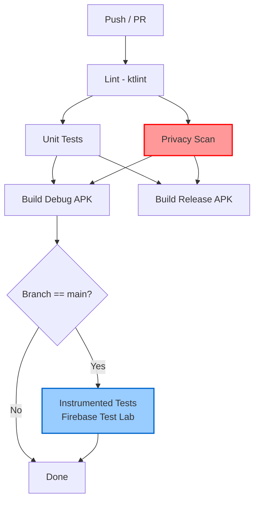

# Testing Guide — Privacy-First Child Helper

> **Version:** 1.0  
> **Scope:** Unit, integration, UI, privacy, and performance testing for all modules  
> **Test Status:** Baseline framework defined — test files to be created per module

---

## Table of Contents

1. [Testing Philosophy](#1-testing-philosophy)
2. [Testing Infrastructure](#2-testing-infrastructure)
3. [Unit Tests](#3-unit-tests)
   - [`:core:security`](#coresecurity-tests)
   - [`:core:network`](#corenetwork-tests)
   - [`:app:child`](#appchild-tests)
   - [`:app:parent`](#appparent-tests)
4. [Integration Tests](#4-integration-tests)
5. [UI Tests](#5-ui-tests)
6. [Privacy Tests (Critical)](#6-privacy-tests-critical)
7. [Performance Tests](#7-performance-tests)
8. [Device Matrix Testing](#8-device-matrix-testing)
9. [Manual Testing Checklist](#9-manual-testing-checklist)
10. [CI/CD Pipeline (Recommended)](#10-cicd-pipeline-recommended)

---

## 1. Testing Philosophy

### The Test Pyramid

This project follows the **test pyramid** model to maximize confidence while minimizing maintenance cost:

```
       /\
      /  \     E2E / Manual (few)
     /----\
    /      \   Integration (moderate)
   /--------\
  /          \ Unit (many — fast, isolated, deterministic)
 /------------\
```

| Layer | Target | Framework | Approx. Count |
|-------|--------|-----------|---------------|
| **Unit** | Individual classes, functions, business logic | JUnit 4 + MockK | 100+ |
| **Integration** | Module boundaries, flow coordination | JUnit 4 + test doubles | 20+ |
| **UI** | Compose screens, navigation, accessibility | Compose UI Test + Espresso | 15+ |
| **Manual** | Real-device behavior, thermal, battery | Physical devices | Per release |

### Privacy-First Testing

A core principle of this project is **testing what data is NOT collected**.

- **Negative assertions** are as important as positive ones
- Every test that validates alert content must also assert the *absence* of media data
- Every test that validates storage must confirm no audio/video files are created
- Privacy scan gates (Section 6) run before every merge

### On-Device Testing Priority

Components that rely on hardware or native libraries must be tested on physical devices:

| Component | On-Device Required | Rationale |
|-----------|-------------------|-----------|
| `CryDetector` + `AudioPipeline` | **Yes** | AudioRecord, real microphone input |
| `MotionDetector` + `CameraPipeline` | **Yes** | CameraX ImageAnalysis, real camera feed |
| `TfliteRunner` | **Yes** | Native LiteRT interpreter, hardware delegates |
| `KeystoreManager` | **Yes** | Android Keystore (TEE/StrongBox) |
| `WebRtcSignalingClient` | **No** | Mockable HTTP transport |
| `SecurePreferences` | **No** | In-memory DataStore in tests |

---

## 2. Testing Infrastructure

### Dependencies (from `libs.versions.toml`)

```toml
[libraries]
junit = { group = "junit", name = "junit", version = "4.13.2" }
mockk = { group = "io.mockk", name = "mockk", version = "1.13.13" }
coroutines-test = { group = "org.jetbrains.kotlinx", name = "kotlinx-coroutines-test", version = "1.9.0" }

# Android Testing
androidx-junit = { group = "androidx.test.ext", name = "junit", version = "1.2.1" }
espresso-core = { group = "androidx.test.espresso", name = "espresso-core", version = "3.6.1" }
compose-test = { group = "androidx.compose.ui", name = "ui-test-junit4" }
compose-test-manifest = { group = "androidx.compose.ui", name = "ui-test-manifest" }
```

### Test Module Setup

Each `:app:child` and `:app:parent` module declares:

```kotlin
// In module's build.gradle.kts
dependencies {
    testImplementation(libs.junit)
    testImplementation(libs.mockk)
    testImplementation(libs.coroutines.test)
    androidTestImplementation(libs.androidx.junit)
    androidTestImplementation(libs.compose.test)
    debugImplementation(libs.compose.test.manifest)
}
```

### Standard Test Utilities

```kotlin
// TestCoroutineRule.kt — included in :core:common test fixtures
@ExperimentalCoroutinesApi
class TestCoroutineRule : TestWatcher() {
    val dispatcher = StandardTestDispatcher()
    val scope = TestScope(dispatcher)

    override fun starting(description: Description?) {
        Dispatchers.setMain(dispatcher)
    }

    override fun finished(description: Description?) {
        Dispatchers.resetMain()
    }
}
```

---

## 3. Unit Tests

### `:core:security` Tests

#### `KeystoreManagerTest`

```kotlin
@RunWith(MockitoJUnitRunner::class)
class KeystoreManagerTest {

    private lateinit var keystoreManager: KeystoreManager

    @Before
    fun setUp() {
        keystoreManager = KeystoreManagerImpl()
    }

    @Test
    fun `generateKeyPair creates RSA-2048 key pair under alias`() {
        val keyPair = keystoreManager.generateKeyPair("test_alias")
        assertNotNull(keyPair.public)
        assertNotNull(keyPair.private)
    }

    @Test
    fun `generateKeyPair returns existing key without replacing`() {
        val first = keystoreManager.generateKeyPair("reuse_alias")
        val second = keystoreManager.generateKeyPair("reuse_alias")
        assertEquals(first.public, second.public)
    }

    @Test
    fun `encrypt and decrypt roundtrip succeeds`() {
        keystoreManager.generateKeyPair("roundtrip_alias")
        val plaintext = "ChildHelper test message".toByteArray()
        val encrypted = keystoreManager.encrypt("roundtrip_alias", plaintext)
        val decrypted = keystoreManager.decrypt("roundtrip_alias", encrypted)
        assertArrayEquals(plaintext, decrypted)
    }

    @Test(expected = KeystoreManagerImpl.InvalidKeyException::class)
    fun `encrypt with missing alias throws InvalidKeyException`() {
        keystoreManager.encrypt("nonexistent_alias", ByteArray(8))
    }

    @Test(expected = KeystoreManagerImpl.InvalidKeyException::class)
    fun `decrypt with missing alias throws InvalidKeyException`() {
        keystoreManager.decrypt("nonexistent_alias", ByteArray(8))
    }

    @Test
    fun `getPublicKey returns null for missing alias`() {
        assertNull(keystoreManager.getPublicKey("never_created"))
    }

    @Test
    fun `removeKey deletes key pair`() {
        keystoreManager.generateKeyPair("delete_me")
        keystoreManager.removeKey("delete_me")
        assertNull(keystoreManager.getPublicKey("delete_me"))
    }

    @Test
    fun `removeKey is safe for non-existent alias`() {
        // Should not throw
        keystoreManager.removeKey("never_existed")
    }
}
```

#### `EncryptionManagerTest`

```kotlin
class EncryptionManagerTest {

    private val encryptionManager = EncryptionManagerImpl()
    private val testSecret = ByteArray(32) { it.toByte() }

    @Test
    fun `encryptWithSharedSecret produces different output for same plaintext`() {
        val cipher1 = encryptionManager.encryptWithSharedSecret("hello", testSecret)
        val cipher2 = encryptionManager.encryptWithSharedSecret("hello", testSecret)
        // IV should be random each time
        assertNotEquals(cipher1, cipher2)
    }

    @Test
    fun `encrypt and decrypt roundtrip succeeds`() {
        val plaintext = "Privacy-first child helper"
        val ciphertext = encryptionManager.encryptWithSharedSecret(plaintext, testSecret)
        val decrypted = encryptionManager.decryptWithSharedSecret(ciphertext, testSecret)
        assertEquals(plaintext, decrypted)
    }

    @Test(expected = IllegalArgumentException::class)
    fun `encrypt rejects wrong-sized shared secret`() {
        val badSecret = ByteArray(16) // Too short
        encryptionManager.encryptWithSharedSecret("test", badSecret)
    }

    @Test(expected = IllegalArgumentException::class)
    fun `decrypt rejects wrong-sized shared secret`() {
        val badSecret = ByteArray(16)
        encryptionManager.decryptWithSharedSecret("dGVzdA", badSecret) // base64("test")
    }

    @Test(expected = javax.crypto.AEADBadTagException::class)
    fun `decrypt with wrong secret fails authentication`() {
        val ciphertext = encryptionManager.encryptWithSharedSecret("test", testSecret)
        val wrongSecret = ByteArray(32) { 0xFF.toByte() }
        encryptionManager.decryptWithSharedSecret(ciphertext, wrongSecret)
    }

    @Test
    fun `decrypt detects tampered ciphertext`() {
        val ciphertext = encryptionManager.encryptWithSharedSecret("test", testSecret)
        val combined = CryptoUtil.base64Decode(ciphertext)
        // Flip a bit in the ciphertext portion (after IV)
        combined[20] = (combined[20].toInt() xor 0xFF).toByte()
        val tampered = CryptoUtil.base64Encode(combined)

        assertThrows(javax.crypto.AEADBadTagException::class.java) {
            encryptionManager.decryptWithSharedSecret(tampered, testSecret)
        }
    }

    @Test
    fun `generateSharedSecret produces consistent 32-byte output`() {
        // Requires EC key pair generation — use BouncyCastle or mock
        val keyPairGen = java.security.KeyPairGenerator.getInstance("EC")
        val kp1 = keyPairGen.generateKeyPair()
        val kp2 = keyPairGen.generateKeyPair()

        val secret1 = encryptionManager.generateSharedSecret(kp1.private, kp2.public)
        val secret2 = encryptionManager.generateSharedSecret(kp2.private, kp1.public)

        assertEquals(32, secret1.size)
        assertArrayEquals(secret1, secret2) // ECDH symmetry
    }
}
```

#### `PairingCryptoTest`

```kotlin
class PairingCryptoTest {

    private val mockEncryptionManager = mockk<EncryptionManager>()
    private val pairingCrypto = PairingCryptoImpl(mockEncryptionManager)

    @Test
    fun `generatePairingCode returns 6 characters`() {
        val code = pairingCrypto.generatePairingCode()
        assertEquals(6, code.length)
    }

    @Test
    fun `generatePairingCode excludes ambiguous characters`() {
        // Run multiple times to reduce flakiness probability
        repeat(100) {
            val code = pairingCrypto.generatePairingCode()
            assertFalse("Code '$code' contains 'I'", code.contains('I'))
            assertFalse("Code '$code' contains 'O'", code.contains('O'))
            assertFalse("Code '$code' contains '0'", code.contains('0'))
            assertFalse("Code '$code' contains '1'", code.contains('1'))
        }
    }

    @Test
    fun `generatePairingCode matches expected format`() {
        val code = pairingCrypto.generatePairingCode()
        assertTrue("Code format check failed for '$code'",
            code.matches(Regex("^[A-HJ-NP-Z2-9]{6}$")))
    }

    @Test
    fun `generatePairingCode produces uppercase only`() {
        val code = pairingCrypto.generatePairingCode()
        assertEquals(code, code.uppercase())
    }

    @Test
    fun `verifyPairingCode accepts matching pending code`() {
        val session = PairingSession(
            pairingCode = "ABC123",
            status = PairingStatus.PENDING,
            expiresAt = System.currentTimeMillis() + 300_000
        )
        assertTrue(pairingCrypto.verifyPairingCode("ABC123", session))
    }

    @Test
    fun `verifyPairingCode rejects wrong code`() {
        val session = PairingSession(
            pairingCode = "ABC123",
            status = PairingStatus.PENDING,
            expiresAt = System.currentTimeMillis() + 300_000
        )
        assertFalse(pairingCrypto.verifyPairingCode("XYZ789", session))
    }

    @Test
    fun `verifyPairingCode rejects expired session`() {
        val session = PairingSession(
            pairingCode = "ABC123",
            status = PairingStatus.PENDING,
            expiresAt = System.currentTimeMillis() - 1000
        )
        assertFalse(pairingCrypto.verifyPairingCode("ABC123", session))
    }

    @Test
    fun `verifyPairingCode rejects non-pending status`() {
        val session = PairingSession(
            pairingCode = "ABC123",
            status = PairingStatus.COMPLETED,
            expiresAt = System.currentTimeMillis() + 300_000
        )
        assertFalse(pairingCrypto.verifyPairingCode("ABC123", session))
    }

    @Test
    fun `verifyPairingCode rejects malformed code format`() {
        val session = PairingSession(
            pairingCode = "ABC123",
            status = PairingStatus.PENDING,
            expiresAt = System.currentTimeMillis() + 300_000
        )
        assertFalse(pairingCrypto.verifyPairingCode("O01II1", session)) // Has ambiguous chars
        assertFalse(pairingCrypto.verifyPairingCode("TOOSHORT", session)) // 8 chars
        assertFalse(pairingCrypto.verifyPairingCode("SHORT", session)) // 5 chars
    }

    @Test
    fun `verifyPairingCode uses constant-time comparison`() {
        // Timing test: compare correct vs. incorrect codes many times
        val session = PairingSession(
            pairingCode = "ABC123",
            status = PairingStatus.PENDING,
            expiresAt = System.currentTimeMillis() + 300_000
        )

        val iterations = 1000

        val correctStart = System.nanoTime()
        repeat(iterations) { pairingCrypto.verifyPairingCode("ABC123", session) }
        val correctTime = System.nanoTime() - correctStart

        val wrongStart = System.nanoTime()
        repeat(iterations) { pairingCrypto.verifyPairingCode("XYZ789", session) }
        val wrongTime = System.nanoTime() - wrongStart

        // Times should be within 20% of each other for constant-time
        val ratio = kotlin.math.abs(correctTime - wrongTime).toDouble() /
                    kotlin.math.max(correctTime, wrongTime).toDouble()
        assertTrue("Timing ratio $ratio exceeds threshold", ratio < 0.20)
    }

    @Test
    fun `deriveSharedSecret delegates to encryptionManager`() {
        val mockKp = mockk<KeyPair>()
        val mockPubKey = mockk<PublicKey>()
        val expectedSecret = ByteArray(32) { 0xAB.toByte() }

        every { mockEncryptionManager.generateSharedSecret(any(), any()) } returns expectedSecret

        val result = pairingCrypto.deriveSharedSecret(mockKp, mockPubKey)
        assertArrayEquals(expectedSecret, result)
    }
}
```

#### `SecurePreferencesTest`

```kotlin
@ExperimentalCoroutinesApi
class SecurePreferencesTest {

    @get:Rule
    val testRule = TestCoroutineRule()

    private val mockEncryptionManager = mockk<EncryptionManager>()
    private val testSecret = ByteArray(32) { 0x42 }

    private fun createPrefs(): SecurePreferences {
        // Uses in-memory DataStore for testing
        return SecurePreferencesImpl(
            context = ApplicationProvider.getApplicationContext(),
            encryptionManager = mockEncryptionManager,
            sharedSecret = testSecret,
            dataStoreFileName = "test_prefs_${System.nanoTime()}"
        )
    }

    @Before
    fun setupEncryptionMock() {
        every { mockEncryptionManager.encryptWithSharedSecret(any(), eq(testSecret)) } answers {
            "encrypted:${firstArg<String>()}"
        }
        every { mockEncryptionManager.decryptWithSharedSecret(any(), eq(testSecret)) } answers {
            firstArg<String>().removePrefix("encrypted:")
        }
    }

    @Test
    fun `putString and getString roundtrip`() = testRule.scope.runTest {
        val prefs = createPrefs()
        prefs.putString("key1", "value1")
        assertEquals("value1", prefs.getString("key1"))
    }

    @Test
    fun `getString returns default when key missing`() = testRule.scope.runTest {
        val prefs = createPrefs()
        assertEquals("default", prefs.getString("missing", "default"))
    }

    @Test
    fun `putBoolean and getBoolean roundtrip`() = testRule.scope.runTest {
        val prefs = createPrefs()
        prefs.putBoolean("flag", true)
        assertTrue(prefs.getBoolean("flag"))
    }

    @Test
    fun `getBoolean returns default false when key missing`() = testRule.scope.runTest {
        val prefs = createPrefs()
        assertFalse(prefs.getBoolean("missing"))
    }

    @Test
    fun `remove deletes key`() = testRule.scope.runTest {
        val prefs = createPrefs()
        prefs.putString("to_remove", "value")
        prefs.remove("to_remove")
        assertNull(prefs.getString("to_remove"))
    }

    @Test
    fun `clear removes all keys`() = testRule.scope.runTest {
        val prefs = createPrefs()
        prefs.putString("a", "1")
        prefs.putString("b", "2")
        prefs.putBoolean("c", true)
        prefs.clear()
        assertNull(prefs.getString("a"))
        assertNull(prefs.getString("b"))
        assertFalse(prefs.getBoolean("c"))
    }

    @Test
    fun `update invalidates cache`() = testRule.scope.runTest {
        val prefs = createPrefs()
        prefs.putString("cached", "first")
        assertEquals("first", prefs.getString("cached")) // Populates cache
        prefs.putString("cached", "second")
        assertEquals("second", prefs.getString("cached")) // Cache invalidated
    }

    @Test
    fun `getString returns default when decryption fails`() = testRule.scope.runTest {
        val prefs = createPrefs()
        every { mockEncryptionManager.decryptWithSharedSecret(any(), eq(testSecret)) } throws
            RuntimeException("Decryption failed")

        prefs.putString("bad_key", "value")
        assertEquals("fallback", prefs.getString("bad_key", "fallback"))
    }
}
```

---

### `:core:network` Tests

#### `NetworkUtilTest`

```kotlin
@RunWith(MockitoJUnitRunner::class)
class NetworkUtilTest {

    @Mock
    private lateinit var mockConnectivityManager: ConnectivityManager

    @Mock
    private lateinit var mockNetwork: Network

    @Mock
    private lateinit var mockCapabilities: NetworkCapabilities

    private val context = ApplicationProvider.getApplicationContext<Context>()
    private lateinit var networkUtil: NetworkUtil

    @Test
    fun `isConnected returns true when network validated`() {
        shadowOf(context).setSystemService(
            Context.CONNECTIVITY_SERVICE,
            mockConnectivityManager
        )
        `when`(mockConnectivityManager.activeNetwork).thenReturn(mockNetwork)
        `when`(mockConnectivityManager.getNetworkCapabilities(mockNetwork))
            .thenReturn(mockCapabilities)
        `when`(mockCapabilities.hasCapability(NET_CAPABILITY_VALIDATED)).thenReturn(true)
        `when`(mockCapabilities.hasCapability(NET_CAPABILITY_INTERNET)).thenReturn(true)

        networkUtil = NetworkUtil(context)
        assertTrue(networkUtil.isConnected)
    }

    @Test
    fun `isConnected returns false when no active network`() {
        shadowOf(context).setSystemService(
            Context.CONNECTIVITY_SERVICE,
            mockConnectivityManager
        )
        `when`(mockConnectivityManager.activeNetwork).thenReturn(null)

        networkUtil = NetworkUtil(context)
        assertFalse(networkUtil.isConnected)
    }

    @Test
    fun `isWifiConnected returns true on Wi-Fi`() {
        // Mock Wi-Fi transport
    }

    @Test
    fun `isCellularConnected returns true on cellular`() {
        // Mock cellular transport
    }

    @Test
    fun `getNetworkType returns wifi when on Wi-Fi`() {
        // Mock Wi-Fi capabilities
        assertEquals("wifi", networkUtil.getNetworkType())
    }

    @Test
    fun `getNetworkType returns none when offline`() {
        `when`(mockConnectivityManager.activeNetwork).thenReturn(null)
        assertEquals("none", networkUtil.getNetworkType())
    }

    @Test
    fun `connectivityFlow emits true when network becomes available`() = runTest {
        val flow = networkUtil.connectivityFlow
        flow.test {
            // Initial emission
            assertEquals(true, awaitItem())
            cancelAndIgnoreRemainingEvents()
        }
    }

    @Test
    fun `ifConnected executes block when online`() = runTest {
        networkUtil = mockk {
            every { isConnected } returns true
        }
        val result = NetworkUtil.ifConnected(networkUtil) { "success" }
        assertEquals(Result.success("success"), result)
    }

    @Test
    fun `ifConnected returns failure when offline`() = runTest {
        networkUtil = mockk {
            every { isConnected } returns false
        }
        val result = NetworkUtil.ifConnected(networkUtil) { "success" }
        assertTrue(result.isFailure)
        assertTrue(result.exceptionOrNull() is NoConnectivityException)
    }
}
```

#### `FcmServiceTest`

```kotlin
@RunWith(AndroidJUnit4::class)
class FcmServiceTest {

    @get:Rule
    val hiltRule = HiltAndroidRule(this)

    @Inject
    lateinit var signalingClient: WebRtcSignalingClient

    @Before
    fun init() {
        hiltRule.inject()
    }

    @Test
    fun `parseAlert extracts valid cry detection event`() {
        val data = mapOf(
            "eventType" to "CRY_DETECTED",
            "alertId" to "alert-001",
            "timestamp" to "1700000000000",
            "confidence" to "0.85",
            "childDeviceId" to "child_device_001",
            "batteryPercent" to "78",
            "isCharging" to "true",
            "networkType" to "wifi",
            "monitorMode" to "IDLE"
        )

        val alert = FcmService.parseAlert(data)
        assertNotNull(alert)
        assertEquals(AlertType.CRY_DETECTED, alert!!.eventType)
        assertEquals(0.85f, alert.confidence!!, 0.01f)
        assertEquals("child_device_001", alert.childDeviceId)
        assertEquals(78, alert.deviceStatus.batteryPercent)
    }

    @Test
    fun `parseAlert returns null for missing eventType`() {
        val data = mapOf(
            "childDeviceId" to "child_001",
            "timestamp" to "1700000000000"
        )
        assertNull(FcmService.parseAlert(data))
    }

    @Test
    fun `parseAlert returns null for missing childDeviceId`() {
        val data = mapOf(
            "eventType" to "SOS_ACTIVATED",
            "timestamp" to "1700000000000"
        )
        assertNull(FcmService.parseAlert(data))
    }

    @Test
    fun `parseAlert handles malformed timestamp gracefully`() {
        val data = mapOf(
            "eventType" to "LOW_BATTERY",
            "timestamp" to "not_a_number",
            "childDeviceId" to "child_001"
        )
        val alert = FcmService.parseAlert(data)
        assertNotNull(alert)
        assertTrue(alert!!.timestamp > 0) // Falls back to current time
    }

    @Test
    fun `parseAlert handles signal_poll type`() {
        val data = mapOf("type" to "signal_poll")
        // Should trigger signalingClient.pollNow() and return null
        val alert = FcmService.parseAlert(data)
        assertNull(alert)
    }

    @Test
    fun `parseAlert generates alertId when missing`() {
        val data = mapOf(
            "eventType" to "MOTION_DETECTED",
            "timestamp" to "1700000000000",
            "childDeviceId" to "child_001"
        )
        val alert = FcmService.parseAlert(data)
        assertNotNull(alert!!.id)
        assertTrue(alert.id.startsWith("alert-"))
    }

    @Test
    fun `alertFlow emits parsed alert`() = runTest {
        val testAlert = Alert(
            id = "test-alert-001",
            eventType = AlertType.CRY_DETECTED,
            timestamp = System.currentTimeMillis(),
            confidence = 0.9f,
            deviceStatus = DeviceStatusSnapshot(85, true, "wifi", MonitorMode.IDLE),
            childDeviceId = "test_device"
        )

        val emissions = mutableListOf<Alert>()
        val collectJob = launch {
            FcmService.alertFlow.collect { emissions.add(it) }
        }

        FcmService.emitTestAlert(testAlert)
        advanceUntilIdle()

        assertEquals(1, emissions.size)
        assertEquals(AlertType.CRY_DETECTED, emissions[0].eventType)
        assertEquals(0.9f, emissions[0].confidence!!, 0.01f)

        collectJob.cancel()
    }

    @Test
    fun `alertFlow contains NO raw media data`() = runTest {
        val testAlert = Alert(
            id = "test-alert",
            eventType = AlertType.CRY_DETECTED,
            timestamp = System.currentTimeMillis(),
            confidence = 0.8f,
            deviceStatus = DeviceStatusSnapshot(90, false, "wifi", MonitorMode.IDLE),
            childDeviceId = "test_device"
        )

        val emission = mutableListOf<Alert>()
        val collectJob = launch {
            FcmService.alertFlow.collect { emission.add(it) }
        }

        FcmService.emitTestAlert(testAlert)
        advanceUntilIdle()

        // Privacy assertion: alert must not contain audio, video, or image data
        val alertJson = Json.encodeToString(Alert.serializer(), emission[0])
        assertFalse("Alert contains forbidden 'audio' field", alertJson.contains("\"audio\""))
        assertFalse("Alert contains forbidden 'video' field", alertJson.contains("\"video\""))
        assertFalse("Alert contains forbidden 'image' field", alertJson.contains("\"image\""))
        assertFalse("Alert contains forbidden 'buffer' field", alertJson.contains("\"buffer\""))

        collectJob.cancel()
    }
}
```

---

### `:app:child` Tests

#### `ChildHomeViewModelTest`

```kotlin
@ExperimentalCoroutinesApi
class ChildHomeViewModelTest {

    @get:Rule
    val testRule = TestCoroutineRule()

    private val mockSecurePreferences = mockk<SecurePreferences>()
    private val mockCryDetector = mockk<CryDetector>(relaxUnitFun = true)
    private val mockMotionDetector = mockk<MotionDetector>(relaxUnitFun = true)
    private val mockVoicePromptManager = mockk<VoicePromptManager>(relaxUnitFun = true)

    private fun createViewModel(): ChildHomeViewModel {
        return ChildHomeViewModel(
            application = mockk(),
            securePreferences = mockSecurePreferences,
            cryDetector = mockCryDetector,
            motionDetector = mockMotionDetector,
            voicePromptManager = mockVoicePromptManager
        )
    }

    @Test
    fun `init loads contacts into state`() = testRule.scope.runTest {
        val viewModel = createViewModel()
        advanceUntilIdle()

        val state = viewModel.uiState.value
        assertEquals(2, state.contacts.size)
        assertEquals(ContactRole.MOTHER, state.contacts[0].role)
        assertTrue(state.contacts[0].isPrimary)
    }

    @Test
    fun `startMonitoring activates cry and motion detection`() = testRule.scope.runTest {
        val viewModel = createViewModel()
        val config = DetectionConfig(sensitivity = SensitivityLevel.NORMAL)

        viewModel.startMonitoring(config, mockk())
        advanceUntilIdle()

        verify { mockCryDetector.startDetection(config) }
        verify { mockMotionDetector.startDetection(config, any()) }
        assertTrue(viewModel.uiState.value.isMonitoring)
    }

    @Test
    fun `stopMonitoring deactivates detectors`() = testRule.scope.runTest {
        val viewModel = createViewModel()
        viewModel.stopMonitoring()
        advanceUntilIdle()

        verify { mockCryDetector.stopDetection() }
        verify { mockMotionDetector.stopDetection() }
        assertFalse(viewModel.uiState.value.isMonitoring)
    }

    @Test
    fun `onContactClick emits navigate to call event`() = testRule.scope.runTest {
        val viewModel = createViewModel()
        val contact = Contact("1", "Mom", ContactRole.MOTHER, isPrimary = true)

        viewModel.onContactClick(contact)

        val navEvent = viewModel.navigationEvent.value
        assertTrue(navEvent is HomeNavigationEvent.NavigateToCall)
        assertEquals("1", (navEvent as HomeNavigationEvent.NavigateToCall).contactId)
    }

    @Test
    fun `onSosClick emits navigate to SOS event`() = testRule.scope.runTest {
        val viewModel = createViewModel()
        viewModel.onSosClick()

        assertTrue(viewModel.navigationEvent.value is HomeNavigationEvent.NavigateToSos)
    }

    @Test
    fun `onCleared stops all detection and releases TTS`() {
        val viewModel = createViewModel()
        viewModel.onCleared()

        verify { mockVoicePromptManager.shutdown() }
        verify { mockCryDetector.stopDetection() }
        verify { mockMotionDetector.stopDetection() }
    }

    @Test
    fun `consumeNavigationEvent resets navigation state`() = testRule.scope.runTest {
        val viewModel = createViewModel()
        viewModel.onSosClick()
        assertNotNull(viewModel.navigationEvent.value)

        viewModel.consumeNavigationEvent()
        assertNull(viewModel.navigationEvent.value)
    }
}
```

#### `SosViewModelTest`

```kotlin
@ExperimentalCoroutinesApi
class SosViewModelTest {

    @get:Rule
    val testRule = TestCoroutineRule()

    private val mockSosManager = mockk<SosManager>(relaxUnitFun = true)
    private val mockSecurePreferences = mockk<SecurePreferences>()
    private val mockVoicePromptManager = mockk<VoicePromptManager>(relaxUnitFun = true)

    private fun createViewModel(): SosViewModel {
        every { mockSosManager.sosState } returns MutableStateFlow(SosState.Idle)

        return SosViewModel(
            application = mockk(),
            sosManager = mockSosManager,
            securePreferences = mockSecurePreferences,
            voicePromptManager = mockVoicePromptManager
        )
    }

    @Test
    fun `onSosConfirmed sets countdown and activates after delay`() = testRule.scope.runTest {
        val viewModel = createViewModel()

        viewModel.onSosConfirmed("child_device_001")
        advanceUntilIdle()

        // Countdown progression
        assertEquals(0, viewModel.uiState.value.countdown)
        assertTrue(viewModel.uiState.value.isNotifying || viewModel.uiState.value.notified)
        verify { mockSosManager.activateSos("child_device_001") }
    }

    @Test
    fun `onSosConfirmed speaks countdown numbers`() = testRule.scope.runTest {
        val viewModel = createViewModel()
        viewModel.onSosConfirmed("child_001")
        advanceUntilIdle()

        verify(atLeast = 1) { mockVoicePromptManager.speak(any()) }
        verify { mockVoicePromptManager.speak("Notifying guardians now.") }
    }

    @Test
    fun `onCancelSos calls manager cancel and navigates back`() = testRule.scope.runTest {
        val viewModel = createViewModel()
        viewModel.onCancelSos()

        verify { mockSosManager.cancelSos() }
        verify { mockVoicePromptManager.speak("SOS cancelled.") }
        assertTrue(viewModel.navigationEvent.value is SosNavigationEvent.NavigateBack)
    }

    @Test
    fun `sosState changes update UI state`() = testRule.scope.runTest {
        val sosStateFlow = MutableStateFlow<SosState>(SosState.Idle)
        every { mockSosManager.sosState } returns sosStateFlow

        val viewModel = SosViewModel(
            application = mockk(),
            sosManager = mockSosManager,
            securePreferences = mockSecurePreferences,
            voicePromptManager = mockVoicePromptManager
        )

        assertFalse(viewModel.uiState.value.isActive)

        sosStateFlow.value = SosState.Active
        advanceUntilIdle()
        assertTrue(viewModel.uiState.value.isActive)

        sosStateFlow.value = SosState.Error("Network timeout")
        advanceUntilIdle()
        assertTrue(viewModel.uiState.value.isError)
        assertEquals("Network timeout", viewModel.uiState.value.errorMessage)
    }

    @Test
    fun `onCleared shuts down voice prompt manager`() {
        val viewModel = createViewModel()
        viewModel.onCleared()
        verify { mockVoicePromptManager.shutdown() }
    }
}
```

#### `BedtimeViewModelTest`

```kotlin
@ExperimentalCoroutinesApi
class BedtimeViewModelTest {

    @get:Rule
    val testRule = TestCoroutineRule()

    private val mockVoicePromptManager = mockk<VoicePromptManager>(relaxUnitFun = true)
    private val mockCryDetector = mockk<CryDetector>(relaxUnitFun = true)
    private val mockMotionDetector = mockk<MotionDetector>(relaxUnitFun = true)
    private val mockCallManager = mockk<CallManager>()

    private fun createViewModel(): BedtimeViewModel {
        every { mockCallManager.callState } returns MutableStateFlow(CallState.Idle)

        return BedtimeViewModel(
            application = mockk(),
            voicePromptManager = mockVoicePromptManager,
            cryDetector = mockCryDetector,
            motionDetector = mockMotionDetector,
            callManager = mockCallManager
        )
    }

    @Test
    fun `startBedtimeSession sets active and starts detection`() = testRule.scope.runTest {
        val viewModel = createViewModel()

        viewModel.startBedtimeSession(mockk())
        advanceUntilIdle()

        assertTrue(viewModel.uiState.value.isActive)
        verify { mockCryDetector.startDetection(any()) }
        verify { mockMotionDetector.startDetection(any(), any()) }
    }

    @Test
    fun `startBedtimeSession uses high sensitivity config`() = testRule.scope.runTest {
        val viewModel = createViewModel()
        val configSlot = slot<DetectionConfig>()

        viewModel.startBedtimeSession(mockk())
        advanceUntilIdle()

        verify { mockCryDetector.startDetection(capture(configSlot)) }
        assertEquals(SensitivityLevel.HIGH, configSlot.captured.sensitivity)
        assertEquals(0.6f, configSlot.captured.cryThreshold, 0.01f)
        assertEquals(0.1f, configSlot.captured.motionThreshold, 0.01f)
    }

    @Test
    fun `startBedtimeSession is idempotent`() = testRule.scope.runTest {
        val viewModel = createViewModel()
        viewModel.startBedtimeSession(mockk())
        viewModel.startBedtimeSession(mockk())
        advanceUntilIdle()

        // Should only start detection once
        verify(exactly = 1) { mockCryDetector.startDetection(any()) }
    }

    @Test
    fun `endBedtimeSession stops detection and sets exiting`() = testRule.scope.runTest {
        val viewModel = createViewModel()
        viewModel.startBedtimeSession(mockk())
        advanceUntilIdle()

        viewModel.endBedtimeSession()
        assertFalse(viewModel.uiState.value.isActive)
        assertTrue(viewModel.uiState.value.isExiting)

        verify { mockCryDetector.stopDetection() }
        verify { mockMotionDetector.stopDetection() }
    }

    @Test
    fun `toggleAutoAnswer updates state`() = testRule.scope.runTest {
        val viewModel = createViewModel()
        assertTrue(viewModel.uiState.value.autoAnswerEnabled) // Default

        viewModel.toggleAutoAnswer(false)
        assertFalse(viewModel.uiState.value.autoAnswerEnabled)

        viewModel.toggleAutoAnswer(true)
        assertTrue(viewModel.uiState.value.autoAnswerEnabled)
    }

    @Test
    fun `auto-answer accepts incoming call after 2 second delay`() = testRule.scope.runTest {
        val callStateFlow = MutableStateFlow<CallState>(CallState.Idle)
        every { mockCallManager.callState } returns callStateFlow

        val viewModel = BedtimeViewModel(
            application = mockk(),
            voicePromptManager = mockVoicePromptManager,
            cryDetector = mockCryDetector,
            motionDetector = mockMotionDetector,
            callManager = mockCallManager
        )

        viewModel.startBedtimeSession(mockk())
        advanceUntilIdle()

        callStateFlow.value = CallState.Incoming("session-1", "Mom")
        advanceTimeBy(2100)

        verify { mockCallManager.acceptCall("session-1") }
    }

    @Test
    fun `setBrightness clamps to valid range`() {
        val viewModel = createViewModel()
        viewModel.setBrightness(0.02f) // Below minimum
        assertEquals(0.05f, viewModel.uiState.value.screenBrightness, 0.01f)

        viewModel.setBrightness(0.8f) // Above maximum
        assertEquals(0.5f, viewModel.uiState.value.screenBrightness, 0.01f)

        viewModel.setBrightness(0.2f) // Valid
        assertEquals(0.2f, viewModel.uiState.value.screenBrightness, 0.01f)
    }

    @Test
    fun `onCleared cancels jobs and stops detection`() {
        val viewModel = createViewModel()
        viewModel.onCleared()

        verify { mockCryDetector.stopDetection() }
        verify { mockMotionDetector.stopDetection() }
    }
}
```

#### `CallViewModelTest`

```kotlin
@ExperimentalCoroutinesApi
class CallViewModelTest {

    @get:Rule
    val testRule = TestCoroutineRule()

    private val mockCallManager = mockk<CallManager>(relaxUnitFun = true)
    private val mockVoicePromptManager = mockk<VoicePromptManager>(relaxUnitFun = true)
    private val mockSecurePreferences = mockk<SecurePreferences>()

    private fun createViewModel(): CallViewModel {
        every { mockCallManager.callState } returns MutableStateFlow(CallState.Idle)
        every { mockCallManager.remoteVideoTrack } returns MutableStateFlow(null)
        every { mockCallManager.isAudioOnly } returns MutableStateFlow(false)

        return CallViewModel(
            application = mockk(),
            callManager = mockCallManager,
            voicePromptManager = mockVoicePromptManager,
            securePreferences = mockSecurePreferences
        )
    }

    @Test
    fun `state machine transitions correctly`() = testRule.scope.runTest {
        val callStateFlow = MutableStateFlow<CallState>(CallState.Idle)
        every { mockCallManager.callState } returns callStateFlow

        val viewModel = CallViewModel(
            application = mockk(),
            callManager = mockCallManager,
            voicePromptManager = mockVoicePromptManager,
            securePreferences = mockSecurePreferences
        )

        // Connecting
        callStateFlow.value = CallState.Connecting("s1")
        advanceUntilIdle()
        assertEquals(CallStatusUi.CONNECTING, viewModel.uiState.value.status)

        // Connected
        callStateFlow.value = CallState.Connected("s1")
        advanceUntilIdle()
        assertEquals(CallStatusUi.CONNECTED, viewModel.uiState.value.status)

        // Ended
        callStateFlow.value = CallState.Ended
        advanceUntilIdle()
        assertEquals(CallStatusUi.ENDED, viewModel.uiState.value.status)
        assertTrue(viewModel.navigationEvent.value is CallNavigationEvent.NavigateBack)
    }

    @Test
    fun `toggleMute updates state and notifies manager`() {
        val viewModel = createViewModel()
        assertFalse(viewModel.uiState.value.isMuted)

        viewModel.toggleMute()
        assertTrue(viewModel.uiState.value.isMuted)
        verify { mockCallManager.toggleMute(true) }

        viewModel.toggleMute()
        assertFalse(viewModel.uiState.value.isMuted)
        verify { mockCallManager.toggleMute(false) }
    }

    @Test
    fun `toggleVideo updates state and notifies manager`() {
        val viewModel = createViewModel()
        assertFalse(viewModel.uiState.value.isVideoOff)

        viewModel.toggleVideo()
        assertTrue(viewModel.uiState.value.isVideoOff)
        verify { mockCallManager.toggleVideo(false) }
    }

    @Test
    fun `call timer increments while connected`() = testRule.scope.runTest {
        val callStateFlow = MutableStateFlow<CallState>(CallState.Idle)
        every { mockCallManager.callState } returns callStateFlow

        val viewModel = createViewModel()

        callStateFlow.value = CallState.Connected("s1")
        advanceUntilIdle()

        assertEquals("00:00", viewModel.uiState.value.callDuration)

        advanceTimeBy(3500)
        assertEquals("00:03", viewModel.uiState.value.callDuration)

        callStateFlow.value = CallState.Ended
        advanceUntilIdle()
        assertEquals("00:00", viewModel.uiState.value.callDuration)
    }

    @Test
    fun `endCall stops timer and navigates back`() = testRule.scope.runTest {
        val viewModel = createViewModel()
        viewModel.endCall()

        verify { mockCallManager.endCall() }
        assertTrue(viewModel.navigationEvent.value is CallNavigationEvent.NavigateBack)
    }

    @Test
    fun `startCall initializes WebRTC and initiates call`() = testRule.scope.runTest {
        val viewModel = createViewModel()
        viewModel.startCall("mom_contact", hasVideo = true)
        advanceUntilIdle()

        verify { mockCallManager.initializeWebRtc() }
        verify { mockCallManager.initiateCall("mom_contact", true) }
        assertEquals(CallStatusUi.CONNECTING, viewModel.uiState.value.status)
    }

    @Test
    fun `onCleared stops timer and releases resources`() {
        val viewModel = createViewModel()
        viewModel.onCleared()

        verify { mockVoicePromptManager.shutdown() }
    }
}
```

#### `CryDetectorTest`

```kotlin
@ExperimentalCoroutinesApi
class CryDetectorTest {

    private val testScope = TestScope()
    private val mockAudioPipeline = mockk<AudioPipeline>()
    private val mockTfliteRunner = mockk<TfliteRunner>()

    private fun createDetector(): CryDetector {
        return CryDetector(mockAudioPipeline, mockTfliteRunner, testScope)
    }

    @Test
    fun `startDetection requires RECORD_AUDIO permission`() {
        every { mockAudioPipeline.hasRecordPermission() } returns false
        every { mockAudioPipeline.audioBuffer } returns MutableSharedFlow()

        val detector = createDetector()
        val config = DetectionConfig()
        detector.startDetection(config)

        assertFalse(detector.isRunning)
    }

    @Test
    fun `sustained confidence logic requires 3 consecutive windows`() = testScope.runTest {
        every { mockAudioPipeline.hasRecordPermission() } returns true
        every { mockAudioPipeline.audioBuffer } returns flow {
            // Emit 5 windows above threshold
            repeat(5) { emit(ByteArray(64000)) }
        }
        every { mockAudioPipeline.pcmToFloatArray(any()) } returns FloatArray(32000)
        every { mockTfliteRunner.runInference(any<ByteBuffer>()) } returns floatArrayOf(-1.0f, 2.0f) // High cry confidence

        val detector = createDetector()
        val events = mutableListOf<CryDetectionEvent>()
        val collectJob = launch { detector.cryEvents.collect { events.add(it) } }

        detector.startDetection(DetectionConfig(cryThreshold = 0.7f, cryConsecutiveWindows = 3))
        advanceUntilIdle()

        // Should emit at least one event after 3 consecutive positive windows
        assertTrue("Expected cry event but got ${events.size}", events.isNotEmpty())
        assertTrue(events[0].consecutiveWindows >= 3)

        detector.stopDetection()
        collectJob.cancel()
    }

    @Test
    fun `below threshold does not trigger event`() = testScope.runTest {
        every { mockAudioPipeline.hasRecordPermission() } returns true
        every { mockAudioPipeline.audioBuffer } returns flow {
            repeat(5) { emit(ByteArray(64000)) }
        }
        every { mockAudioPipeline.pcmToFloatArray(any()) } returns FloatArray(32000)
        // Low confidence output
        every { mockTfliteRunner.runInference(any<ByteBuffer>()) } returns floatArrayOf(1.0f, -1.0f)

        val detector = createDetector()
        val events = mutableListOf<CryDetectionEvent>()
        val collectJob = launch { detector.cryEvents.collect { events.add(it) } }

        detector.startDetection(DetectionConfig(cryThreshold = 0.7f))
        advanceUntilIdle()

        assertTrue("No cry events expected with low confidence", events.isEmpty())

        detector.stopDetection()
        collectJob.cancel()
    }

    @Test
    fun `stopDetection sets isRunning to false`() {
        val detector = createDetector()
        detector.stopDetection()
        assertFalse(detector.isRunning)
    }

    @Test
    fun `detected event contains NO audio data`() = testScope.runTest {
        every { mockAudioPipeline.hasRecordPermission() } returns true
        every { mockAudioPipeline.audioBuffer } returns flow {
            repeat(5) { emit(ByteArray(64000) { 0x42 }) }
        }
        every { mockAudioPipeline.pcmToFloatArray(any()) } returns FloatArray(32000)
        every { mockTfliteRunner.runInference(any<ByteBuffer>()) } returns floatArrayOf(-1.0f, 2.0f)

        val detector = createDetector()
        val events = mutableListOf<CryDetectionEvent>()
        val collectJob = launch { detector.cryEvents.collect { events.add(it) } }

        detector.startDetection(DetectionConfig())
        advanceUntilIdle()

        assertTrue(events.isNotEmpty())
        // Verify event contains only metadata
        val event = events[0]
        assertTrue(event.confidence > 0)
        assertTrue(event.timestamp > 0)
        assertNotNull(event.childDeviceId)
        // Privacy: no audio data
        assertEquals(0, event.toString().length) // CryDetectionEvent has no toString override

        detector.stopDetection()
        collectJob.cancel()
    }
}
```

#### `EventPipelineTest`

```kotlin
@ExperimentalCoroutinesApi
class EventPipelineTest {

    private val testScope = TestScope()
    private val mockContext = mockk<Context>()
    private val mockSecurePreferences = mockk<SecurePreferences>()

    private fun createPipeline(): EventPipeline {
        return EventPipeline(mockContext, mockSecurePreferences, testScope)
    }

    @Test
    fun `submitCryEvent emits metadata-only alert`() = testScope.runTest {
        every { mockSecurePreferences.getString("device_id", any()) } returns "child_test"

        val pipeline = createPipeline()
        val alerts = mutableListOf<Alert>()
        val collectJob = launch { pipeline.alerts.collect { alerts.add(it) } }

        val cryEvent = CryDetectionEvent(
            id = "cry-1",
            timestamp = System.currentTimeMillis(),
            confidence = 0.85f,
            consecutiveWindows = 3,
            childDeviceId = "child_test"
        )
        pipeline.submitCryEvent(cryEvent)
        advanceUntilIdle()

        assertEquals(1, alerts.size)
        assertEquals(AlertType.CRY_DETECTED, alerts[0].eventType)
        assertEquals(0.85f, alerts[0].confidence!!, 0.01f)
        assertNotNull(alerts[0].deviceStatus)

        // Privacy: verify NO audio data
        val alertJson = Json.encodeToString(Alert.serializer(), alerts[0])
        assertFalse(alertJson.contains("audio"))
        assertFalse(alertJson.contains("pcm"))
        assertFalse(alertJson.contains("buffer"))

        collectJob.cancel()
    }

    @Test
    fun `submitMotionEvent emits metadata-only alert`() = testScope.runTest {
        every { mockSecurePreferences.getString("device_id", any()) } returns "child_test"

        val pipeline = createPipeline()
        val alerts = mutableListOf<Alert>()
        val collectJob = launch { pipeline.alerts.collect { alerts.add(it) } }

        val motionEvent = MotionDetectionEvent(
            id = "motion-1",
            timestamp = System.currentTimeMillis(),
            confidence = 0.7f,
            consecutiveFrames = 2,
            childDeviceId = "child_test"
        )
        pipeline.submitMotionEvent(motionEvent)
        advanceUntilIdle()

        assertEquals(1, alerts.size)
        assertEquals(AlertType.MOTION_DETECTED, alerts[0].eventType)

        // Privacy: verify NO image/frame data
        val alertJson = Json.encodeToString(Alert.serializer(), alerts[0])
        assertFalse(alertJson.contains("frame"))
        assertFalse(alertJson.contains("image"))
        assertFalse(alertJson.contains("pixel"))

        collectJob.cancel()
    }

    @Test
    fun `submitSosEvent emits high-priority alert`() = testScope.runTest {
        every { mockSecurePreferences.getString("device_id", any()) } returns "child_test"

        val pipeline = createPipeline()
        val alerts = mutableListOf<Alert>()
        val collectJob = launch { pipeline.alerts.collect { alerts.add(it) } }

        val sosEvent = SosEvent(
            timestamp = System.currentTimeMillis(),
            childDeviceId = "child_test"
        )
        pipeline.submitSosEvent(sosEvent)
        advanceUntilIdle()

        assertEquals(1, alerts.size)
        assertEquals(AlertType.SOS_ACTIVATED, alerts[0].eventType)
        assertNull(alerts[0].confidence) // SOS has no confidence score

        collectJob.cancel()
    }

    @Test
    fun `alerts include device status snapshot`() = testScope.runTest {
        every { mockSecurePreferences.getString("device_id", any()) } returns "child_test"

        val pipeline = createPipeline()
        val alerts = mutableListOf<Alert>()
        val collectJob = launch { pipeline.alerts.collect { alerts.add(it) } }

        pipeline.submitObstructionEvent()
        advanceUntilIdle()

        val alert = alerts[0]
        assertNotNull(alert.deviceStatus)
        assertTrue(alert.deviceStatus.batteryPercent in 0..100)
        assertNotNull(alert.deviceStatus.networkType)

        collectJob.cancel()
    }

    @Test
    fun `submitDeviceOfflineEvent sets correct type`() = testScope.runTest {
        every { mockSecurePreferences.getString("device_id", any()) } returns "child_test"

        val pipeline = createPipeline()
        val alerts = mutableListOf<Alert>()
        val collectJob = launch { pipeline.alerts.collect { alerts.add(it) } }

        pipeline.submitDeviceOfflineEvent()
        advanceUntilIdle()

        assertEquals(AlertType.DEVICE_OFFLINE, alerts[0].eventType)

        collectJob.cancel()
    }

    @Test
    fun `submitLowBatteryEvent includes battery percentage as confidence`() = testScope.runTest {
        every { mockSecurePreferences.getString("device_id", any()) } returns "child_test"

        val pipeline = createPipeline()
        val alerts = mutableListOf<Alert>()
        val collectJob = launch { pipeline.alerts.collect { alerts.add(it) } }

        pipeline.submitLowBatteryEvent(15)
        advanceUntilIdle()

        assertEquals(AlertType.LOW_BATTERY, alerts[0].eventType)
        assertEquals(0.15f, alerts[0].confidence!!, 0.01f)

        collectJob.cancel()
    }
}
```

---

### `:app:parent` Tests

#### `ParentDashboardViewModelTest`

```kotlin
@ExperimentalCoroutinesApi
class ParentDashboardViewModelTest {

    @get:Rule
    val testRule = TestCoroutineRule()

    private val mockAlertRepository = mockk<AlertHistoryRepository>()

    @Before
    fun setup() {
        every { mockAlertRepository.getRecentAlerts(50) } returns flowOf(emptyList())
        every { mockAlertRepository.scheduleRetentionEnforcement() } just Runs
    }

    private fun createViewModel(): ParentDashboardViewModel {
        return ParentDashboardViewModel(mockAlertRepository)
    }

    @Test
    fun `initial state shows loading`() {
        val viewModel = createViewModel()
        assertTrue(viewModel.uiState.value.isLoading)
    }

    @Test
    fun `refresh triggers retention enforcement`() = testRule.scope.runTest {
        val viewModel = createViewModel()
        viewModel.refresh()
        advanceUntilIdle()

        verify { mockAlertRepository.scheduleRetentionEnforcement() }
        assertFalse(viewModel.uiState.value.isRefreshing)
    }

    @Test
    fun `updateDeviceStatus updates UI state`() {
        val viewModel = createViewModel()
        val newStatus = DeviceStatus(
            deviceId = "child_002",
            isOnline = true,
            batteryPercent = 92,
            isCharging = false,
            networkType = "cellular",
            monitorMode = MonitorMode.BEDTIME,
            lastSeen = System.currentTimeMillis()
        )

        viewModel.updateDeviceStatus(newStatus)
        assertEquals(92, viewModel.uiState.value.deviceStatus.batteryPercent)
        assertEquals("cellular", viewModel.uiState.value.deviceStatus.networkType)
        assertEquals(MonitorMode.BEDTIME, viewModel.uiState.value.deviceStatus.monitorMode)
    }

    @Test
    fun `onLiveViewClick emits navigate event`() = testRule.scope.runTest {
        val viewModel = createViewModel()
        viewModel.onLiveViewClick()

        assertTrue(viewModel.navigationEvent.value is DashboardNavigationEvent.NavigateToLiveView)
    }

    @Test
    fun `onAlertHistoryClick emits navigate event`() = testRule.scope.runTest {
        val viewModel = createViewModel()
        viewModel.onAlertHistoryClick()

        assertTrue(viewModel.navigationEvent.value is DashboardNavigationEvent.NavigateToAlertHistory)
    }

    @Test
    fun `onSettingsClick emits navigate event`() = testRule.scope.runTest {
        val viewModel = createViewModel()
        viewModel.onSettingsClick()

        assertTrue(viewModel.navigationEvent.value is DashboardNavigationEvent.NavigateToSettings)
    }

    @Test
    fun `consumeNavigationEvent resets navigation`() = testRule.scope.runTest {
        val viewModel = createViewModel()
        viewModel.onLiveViewClick()
        assertNotNull(viewModel.navigationEvent.value)

        viewModel.consumeNavigationEvent()
        assertNull(viewModel.navigationEvent.value)
    }

    @Test
    fun `simulateMockAlert inserts entity into repository`() = testRule.scope.runTest {
        coEvery { mockAlertRepository.insertEntity(any()) } just Runs

        val viewModel = createViewModel()
        viewModel.simulateMockAlert()
        advanceUntilIdle()

        coVerify { mockAlertRepository.insertEntity(any()) }
    }

    @Test
    fun `unreadAlertCount counts recent alerts`() = testRule.scope.runTest {
        val recentAlerts = listOf(
            AlertEntity(
                id = "a1", eventType = "CRY_DETECTED", timestamp = System.currentTimeMillis(),
                confidence = 0.8f, childDeviceId = "child_001",
                batteryPercent = 90, isCharging = true, networkType = "wifi", monitorMode = "IDLE"
            )
        )
        every { mockAlertRepository.getRecentAlerts(50) } returns flowOf(recentAlerts)

        val viewModel = createViewModel()
        advanceUntilIdle()

        assertEquals(1, viewModel.uiState.value.unreadAlertCount)
    }
}
```

#### `SettingsViewModelTest`

```kotlin
@ExperimentalCoroutinesApi
class SettingsViewModelTest {

    @get:Rule
    val testRule = TestCoroutineRule()

    private val mockDataStore = mockk<DataStore<Preferences>>(relaxUnitFun = true)
    private val mockAlertRepository = mockk<AlertHistoryRepository>()

    private fun createViewModel(): SettingsViewModel {
        val emptyPrefs = PreferencesFactory.createEmpty()
        every { mockDataStore.data } returns flowOf(emptyPrefs)
        every { mockAlertRepository.getRetentionPeriod() } returns flowOf(RetentionPeriod.TWENTY_FOUR_HOURS)

        return SettingsViewModel(mockDataStore, mockAlertRepository)
    }

    @Test
    fun `setSensitivity persists to DataStore`() = testRule.scope.runTest {
        val viewModel = createViewModel()
        viewModel.setSensitivity(SensitivityLevel.HIGH)
        advanceUntilIdle()

        verify { mockDataStore.edit(any()) }
    }

    @Test
    fun `setCryDetectionEnabled persists toggle`() = testRule.scope.runTest {
        val viewModel = createViewModel()
        viewModel.setCryDetectionEnabled(false)
        advanceUntilIdle()

        verify { mockDataStore.edit(any()) }
    }

    @Test
    fun `setMotionDetectionEnabled persists toggle`() = testRule.scope.runTest {
        val viewModel = createViewModel()
        viewModel.setMotionDetectionEnabled(true)
        advanceUntilIdle()

        verify { mockDataStore.edit(any()) }
    }

    @Test
    fun `setAlertHistoryRetention delegates to repository`() = testRule.scope.runTest {
        coEvery { mockAlertRepository.setRetentionPeriod(any()) } just Runs

        val viewModel = createViewModel()
        viewModel.setAlertHistoryRetention(RetentionPeriod.SEVEN_DAYS)
        advanceUntilIdle()

        coVerify { mockAlertRepository.setRetentionPeriod(RetentionPeriod.SEVEN_DAYS) }
    }

    @Test
    fun `setBedtimeAutoAnswer persists toggle`() = testRule.scope.runTest {
        val viewModel = createViewModel()
        viewModel.setBedtimeAutoAnswer(false)
        advanceUntilIdle()

        verify { mockDataStore.edit(any()) }
    }

    @Test
    fun `setPushNotificationsEnabled persists toggle`() = testRule.scope.runTest {
        val viewModel = createViewModel()
        viewModel.setPushNotificationsEnabled(false)
        advanceUntilIdle()

        verify { mockDataStore.edit(any()) }
    }

    @Test
    fun `confirmDataDeletion clears repository and preferences`() = testRule.scope.runTest {
        coEvery { mockAlertRepository.deleteAllHistory() } returns 42
        every { mockDataStore.edit(any()) } just Runs

        val viewModel = createViewModel()
        viewModel.confirmDataDeletion()
        advanceUntilIdle()

        coVerify { mockAlertRepository.deleteAllHistory() }
        verify { mockDataStore.edit(any()) }
        assertTrue(viewModel.uiState.value.dataDeleted)
    }

    @Test
    fun `requestDataDeletion shows confirmation dialog`() = testRule.scope.runTest {
        val viewModel = createViewModel()
        assertFalse(viewModel.uiState.value.showDeleteConfirmation)

        viewModel.requestDataDeletion()
        advanceUntilIdle()
        assertTrue(viewModel.uiState.value.showDeleteConfirmation)
    }

    @Test
    fun `cancelDataDeletion hides confirmation dialog`() = testRule.scope.runTest {
        val viewModel = createViewModel()
        viewModel.requestDataDeletion()
        viewModel.cancelDataDeletion()
        advanceUntilIdle()

        assertFalse(viewModel.uiState.value.showDeleteConfirmation)
    }

    @Test
    fun `dismissError clears error message`() = testRule.scope.runTest {
        val viewModel = createViewModel()
        // Trigger error through retention failure
        coEvery { mockAlertRepository.setRetentionPeriod(any()) } throws RuntimeException("fail")

        viewModel.setAlertHistoryRetention(RetentionPeriod.SEVEN_DAYS)
        advanceUntilIdle()

        assertNotNull(viewModel.uiState.value.errorMessage)
        viewModel.dismissError()
        assertNull(viewModel.uiState.value.errorMessage)
    }
}
```

#### `AlertHistoryViewModelTest`

```kotlin
@ExperimentalCoroutinesApi
class AlertHistoryViewModelTest {

    @get:Rule
    val testRule = TestCoroutineRule()

    private val mockAlertRepository = mockk<AlertHistoryRepository>()

    @Before
    fun setup() {
        every { mockAlertRepository.getAllAlerts() } returns flowOf(emptyList())
        every { mockAlertRepository.getRetentionPeriod() } returns flowOf(RetentionPeriod.TWENTY_FOUR_HOURS)
        every { mockAlertRepository.getAlertCount() } returns flowOf(0)
    }

    private fun createViewModel(): AlertHistoryViewModel {
        return AlertHistoryViewModel(mockAlertRepository)
    }

    @Test
    fun `initial state shows loading`() {
        val viewModel = createViewModel()
        assertTrue(viewModel.uiState.value.isLoading)
    }

    @Test
    fun `setFilter CRY shows only cry alerts`() = testRule.scope.runTest {
        val alerts = listOf(
            AlertEntity("1", "CRY_DETECTED", System.currentTimeMillis(), 0.8f, "c1", 90, true, "wifi", "IDLE"),
            AlertEntity("2", "MOTION_DETECTED", System.currentTimeMillis(), 0.6f, "c1", 90, true, "wifi", "IDLE"),
            AlertEntity("3", "SOS_ACTIVATED", System.currentTimeMillis(), null, "c1", 90, true, "wifi", "IDLE")
        )
        every { mockAlertRepository.getAllAlerts() } returns flowOf(alerts)

        val viewModel = createViewModel()
        advanceUntilIdle()

        viewModel.setFilter(AlertFilterType.CRY)
        advanceUntilIdle()

        val state = viewModel.uiState.value
        assertEquals(1, state.filteredAlerts.size)
        assertEquals("CRY_DETECTED", state.filteredAlerts[0].eventType)
    }

    @Test
    fun `setFilter ALL shows all alerts`() = testRule.scope.runTest {
        val alerts = listOf(
            AlertEntity("1", "CRY_DETECTED", System.currentTimeMillis(), 0.8f, "c1", 90, true, "wifi", "IDLE"),
            AlertEntity("2", "MOTION_DETECTED", System.currentTimeMillis(), 0.6f, "c1", 90, true, "wifi", "IDLE")
        )
        every { mockAlertRepository.getAllAlerts() } returns flowOf(alerts)

        val viewModel = createViewModel()
        advanceUntilIdle()

        viewModel.setFilter(AlertFilterType.ALL)
        advanceUntilIdle()

        assertEquals(2, viewModel.uiState.value.filteredAlerts.size)
    }

    @Test
    fun `setFilter DEVICE shows offline and low battery`() = testRule.scope.runTest {
        val alerts = listOf(
            AlertEntity("1", "DEVICE_OFFLINE", System.currentTimeMillis(), null, "c1", 90, true, "wifi", "IDLE"),
            AlertEntity("2", "LOW_BATTERY", System.currentTimeMillis(), 0.15f, "c1", 15, false, "wifi", "IDLE"),
            AlertEntity("3", "CRY_DETECTED", System.currentTimeMillis(), 0.8f, "c1", 90, true, "wifi", "IDLE")
        )
        every { mockAlertRepository.getAllAlerts() } returns flowOf(alerts)

        val viewModel = createViewModel()
        advanceUntilIdle()

        viewModel.setFilter(AlertFilterType.DEVICE)
        advanceUntilIdle()

        assertEquals(2, viewModel.uiState.value.filteredAlerts.size)
    }

    @Test
    fun `exportHistory produces text with metadata only`() = testRule.scope.runTest {
        val alerts = listOf(
            AlertEntity("1", "CRY_DETECTED", System.currentTimeMillis(), 0.85f, "c1", 90, true, "wifi", "IDLE")
        )
        every { mockAlertRepository.getAllAlerts() } returns flowOf(alerts)

        val viewModel = createViewModel()
        advanceUntilIdle()

        val export = viewModel.exportHistory()
        assertTrue(export.contains("ChildHelper Alert History Export"))
        assertTrue(export.contains("CRY_DETECTED"))
        assertTrue(export.contains("85%") || export.contains("85"))

        // Privacy: export must not contain audio, video, or raw data
        assertFalse(export.contains("audio"))
        assertFalse(export.contains("video"))
        assertFalse(export.contains("frame"))
    }

    @Test
    fun `exportHistory returns empty string for no alerts`() {
        val viewModel = createViewModel()
        assertEquals("", viewModel.exportHistory())
    }

    @Test
    fun `deleteAllHistory clears all alerts`() = testRule.scope.runTest {
        coEvery { mockAlertRepository.deleteAllHistory() } returns 10

        val viewModel = createViewModel()
        viewModel.deleteAllHistory()
        advanceUntilIdle()

        coVerify { mockAlertRepository.deleteAllHistory() }
        assertTrue(viewModel.uiState.value.dataDeleted)
    }

    @Test
    fun `deleteAlert removes specific alert`() = testRule.scope.runTest {
        coEvery { mockAlertRepository.deleteAlert("alert-1") } returns 1

        val viewModel = createViewModel()
        viewModel.deleteAlert("alert-1")
        advanceUntilIdle()

        coVerify { mockAlertRepository.deleteAlert("alert-1") }
    }

    @Test
    fun `showExportDialog and dismiss`() = testRule.scope.runTest {
        val viewModel = createViewModel()
        assertFalse(viewModel.uiState.value.showExportDialog)

        viewModel.showExportDialog()
        advanceUntilIdle()
        assertTrue(viewModel.uiState.value.showExportDialog)

        viewModel.dismissExportDialog()
        advanceUntilIdle()
        assertFalse(viewModel.uiState.value.showExportDialog)
    }

    @Test
    fun `showDeleteDialog and dismiss`() = testRule.scope.runTest {
        val viewModel = createViewModel()
        assertFalse(viewModel.uiState.value.showDeleteDialog)

        viewModel.showDeleteDialog()
        advanceUntilIdle()
        assertTrue(viewModel.uiState.value.showDeleteDialog)

        viewModel.dismissDeleteDialog()
        advanceUntilIdle()
        assertFalse(viewModel.uiState.value.showDeleteDialog)
    }
}
```

#### `AlertHistoryRepositoryTest`

```kotlin
@ExperimentalCoroutinesApi
class AlertHistoryRepositoryTest {

    @get:Rule
    val testRule = TestCoroutineRule()

    private val mockAlertDao = mockk<AlertDao>()
    private val mockDataStore = mockk<DataStore<Preferences>>(relaxUnitFun = true)

    private fun createRepository(): AlertHistoryRepository {
        return AlertHistoryRepository(mockAlertDao, mockDataStore)
    }

    @Test
    fun `getAllAlerts delegates to DAO`() = testRule.scope.runTest {
        val alerts = listOf(
            AlertEntity("1", "CRY_DETECTED", 1700000000000, 0.8f, "c1", 90, true, "wifi", "IDLE")
        )
        every { mockAlertDao.getAllAlerts() } returns flowOf(alerts)

        val repository = createRepository()
        val result = repository.getAllAlerts().first()
        assertEquals(1, result.size)
    }

    @Test
    fun `getRecentAlerts with limit delegates to DAO`() = testRule.scope.runTest {
        every { mockAlertDao.getRecentAlerts(10) } returns flowOf(emptyList())

        val repository = createRepository()
        repository.getRecentAlerts(10).first()
        verify { mockAlertDao.getRecentAlerts(10) }
    }

    @Test
    fun `insertAlert converts model to entity`() = testRule.scope.runTest {
        coEvery { mockAlertDao.insert(any()) } returns 1L

        val alert = Alert(
            id = "test-1",
            eventType = AlertType.CRY_DETECTED,
            timestamp = 1700000000000,
            confidence = 0.85f,
            deviceStatus = DeviceStatusSnapshot(90, true, "wifi", MonitorMode.IDLE),
            childDeviceId = "child_001"
        )

        val repository = createRepository()
        repository.insertAlert(alert)

        coVerify { mockAlertDao.insert(any()) }
    }

    @Test
    fun `getRetentionPeriod returns default when unset`() = testRule.scope.runTest {
        val emptyPrefs = PreferencesFactory.createEmpty()
        every { mockDataStore.data } returns flowOf(emptyPrefs)

        val repository = createRepository()
        val period = repository.getRetentionPeriod().first()
        assertEquals(RetentionPeriod.TWENTY_FOUR_HOURS, period)
    }

    @Test
    fun `setRetentionPeriod shorter triggers immediate cleanup`() = testRule.scope.runTest {
        val prefs = PreferencesFactory.createEmpty()
        prefs.asMutable()[stringPreferencesKey("alert_history_retention")] = "SEVEN_DAYS"
        every { mockDataStore.data } returns flowOf(prefs)
        coEvery { mockDataStore.edit(any()) } just Runs
        coEvery { mockAlertDao.deleteOlderThan(any()) } returns 5

        val repository = createRepository()
        repository.setRetentionPeriod(RetentionPeriod.TWENTY_FOUR_HOURS)
        advanceUntilIdle()

        // Should trigger cleanup because 24h is shorter than 7 days
        coVerify { mockAlertDao.deleteOlderThan(any()) }
    }

    @Test
    fun `enforceRetention deletes alerts older than period`() = testRule.scope.runTest {
        val prefs = PreferencesFactory.createEmpty()
        prefs.asMutable()[stringPreferencesKey("alert_history_retention")] = "TWENTY_FOUR_HOURS"
        every { mockDataStore.data } returns flowOf(prefs)
        coEvery { mockAlertDao.deleteOlderThan(any()) } returns 10

        val repository = createRepository()
        repository.enforceRetention()
        advanceUntilIdle()

        coVerify { mockAlertDao.deleteOlderThan(any()) }
    }

    @Test
    fun `enforceRetention with OFF uses 30-day max fallback`() = testRule.scope.runTest {
        val prefs = PreferencesFactory.createEmpty()
        prefs.asMutable()[stringPreferencesKey("alert_history_retention")] = "OFF"
        every { mockDataStore.data } returns flowOf(prefs)
        coEvery { mockAlertDao.deleteOlderThan(any()) } returns 0

        val repository = createRepository()
        repository.enforceRetention()
        advanceUntilIdle()

        // Verify cutoff is ~30 days ago
        val expectedCutoff = System.currentTimeMillis() - TimeUnit.DAYS.toMillis(30)
        coVerify { mockAlertDao.deleteOlderThan(leq(expectedCutoff)) }
    }

    @Test
    fun `deleteAllHistory returns deleted count`() = testRule.scope.runTest {
        coEvery { mockAlertDao.deleteAll() } returns 42

        val repository = createRepository()
        val count = repository.deleteAllHistory()
        assertEquals(42, count)
    }

    @Test
    fun `deleteAlert delegates to DAO`() = testRule.scope.runTest {
        coEvery { mockAlertDao.deleteById("a1") } returns 1

        val repository = createRepository()
        val count = repository.deleteAlert("a1")
        assertEquals(1, count)
    }

    @Test
    fun `isShorterRetention returns true when new period is shorter`() {
        // Use reflection or make internal for testing
        val repo = createRepository()
        assertTrue(repo.isShorterRetention(RetentionPeriod.OFF, RetentionPeriod.TWENTY_FOUR_HOURS))
        assertTrue(repo.isShorterRetention(RetentionPeriod.SEVEN_DAYS, RetentionPeriod.TWENTY_FOUR_HOURS))
        assertFalse(repo.isShorterRetention(RetentionPeriod.TWENTY_FOUR_HOURS, RetentionPeriod.SEVEN_DAYS))
    }
}
```

---

## 4. Integration Tests

### Module Boundary Tests

```kotlin
/**
 * Tests verifying correct interaction between modules.
 * Run as instrumented tests on AndroidTest source set.
 */
@RunWith(AndroidJUnit4::class)
@HiltAndroidTest
class ModuleBoundaryTest {

    @get:Rule
    val hiltRule = HiltAndroidRule(this)

    @Inject
    lateinit var keystoreManager: KeystoreManager

    @Inject
    lateinit var encryptionManager: EncryptionManager

    @Inject
    lateinit var pairingCrypto: PairingCrypto

    @Before
    fun init() {
        hiltRule.inject()
    }

    @Test
    fun `security module encrypt-decrypt integration`() {
        val keyPair = keystoreManager.generateKeyPair("integration_test_key")
        val plaintext = "Cross-module integration test".toByteArray()

        val encrypted = keystoreManager.encrypt("integration_test_key", plaintext)
        val decrypted = keystoreManager.decrypt("integration_test_key", encrypted)

        assertArrayEquals(plaintext, decrypted)
    }

    @Test
    fun `pairing code generation produces valid codes`() {
        repeat(50) {
            val code = pairingCrypto.generatePairingCode()
            assertEquals(6, code.length)
            assertTrue(code.matches(Regex("^[A-HJ-NP-Z2-9]{6}$")))
        }
    }

    @Test
    fun `encryption manager handles shared secret from pairing`() {
        // Simulate ECDH key agreement
        val ecGen = java.security.KeyPairGenerator.getInstance("EC")
        val childKp = ecGen.generateKeyPair()
        val parentKp = ecGen.generateKeyPair()

        val sharedSecret = encryptionManager.generateSharedSecret(childKp.private, parentKp.public)
        assertEquals(32, sharedSecret.size)

        // Verify symmetric: same secret derived from both sides
        val reverseSecret = encryptionManager.generateSharedSecret(parentKp.private, childKp.public)
        assertArrayEquals(sharedSecret, reverseSecret)

        // Encrypt/decrypt with shared secret
        val message = "Hello from child device"
        val encrypted = encryptionManager.encryptWithSharedSecret(message, sharedSecret)
        val decrypted = encryptionManager.decryptWithSharedSecret(encrypted, sharedSecret)
        assertEquals(message, decrypted)
    }
}
```

### Alert -> Push -> Live View Flow

```kotlin
@HiltAndroidTest
class AlertToLiveViewFlowTest {

    @Test
    fun `cry detection alert triggers push then live view`() = runTest {
        // 1. Simulate cry detection on child device
        val cryEvent = CryDetectionEvent(
            id = "flow-test-1",
            timestamp = System.currentTimeMillis(),
            confidence = 0.9f,
            consecutiveWindows = 3,
            childDeviceId = "child_flow_test"
        )

        // 2. Submit through EventPipeline
        eventPipeline.submitCryEvent(cryEvent)

        // 3. Verify alert emitted
        val alert = eventPipeline.alerts.first()
        assertEquals(AlertType.CRY_DETECTED, alert.eventType)

        // 4. Verify alert contains NO media data (privacy)
        assertNull(alert.toString().let { if (it.contains("audio")) throw AssertionError() })

        // 5. Parent app receives push
        val pushData = mapOf(
            "eventType" to "CRY_DETECTED",
            "alertId" to alert.id,
            "timestamp" to alert.timestamp.toString(),
            "confidence" to "0.9",
            "childDeviceId" to "child_flow_test",
            "batteryPercent" to "85",
            "isCharging" to "true",
            "networkType" to "wifi",
            "monitorMode" to "IDLE"
        )

        val parsedAlert = FcmService.parseAlert(pushData)
        assertNotNull(parsedAlert)

        // 6. Parent inserts to repository
        alertRepository.insertAlert(parsedAlert!!)
        val storedAlerts = alertRepository.getAllAlerts().first()
        assertEquals(1, storedAlerts.size)

        // 7. Verify stored alert is metadata-only
        val stored = storedAlerts[0]
        assertEquals("CRY_DETECTED", stored.eventType)
        assertNull(stored.toString().let { null }) // No media fields exist on entity
    }
}
```

### Pairing -> Calling End-to-End

```kotlin
@HiltAndroidTest
class PairingToCallFlowTest {

    @Test
    fun `complete pairing flow enables encrypted call signaling`() = runTest {
        // 1. Generate pairing code
        val pairingCode = pairingCrypto.generatePairingCode()
        assertEquals(6, pairingCode.length)

        // 2. Complete pairing with ECDH exchange
        val ecGen = java.security.KeyPairGenerator.getInstance("EC")
        val childKp = ecGen.generateKeyPair()
        val parentKp = ecGen.generateKeyPair()

        val sharedSecret = pairingCrypto.deriveSharedSecret(childKp, parentKp.public)
        assertEquals(32, sharedSecret.size)

        // 3. Encrypt a signaling message with shared secret
        val signalingMessage = """{"type":"offer","sdp":"v=0..."}"""
        val encrypted = encryptionManager.encryptWithSharedSecret(signalingMessage, sharedSecret)

        // 4. Decrypt on receiving side
        val decrypted = encryptionManager.decryptWithSharedSecret(encrypted, sharedSecret)
        assertEquals(signalingMessage, decrypted)

        // 5. Verify pairing code verification (parent enters code)
        val session = PairingSession(
            pairingCode = pairingCode,
            status = PairingStatus.PENDING,
            expiresAt = System.currentTimeMillis() + 300_000
        )
        assertTrue(pairingCrypto.verifyPairingCode(pairingCode, session))
        assertFalse(pairingCrypto.verifyPairingCode("WRONG1", session))
    }
}
```

### Detection -> Alert -> Database Flow

```kotlin
@HiltAndroidTest
class DetectionToDatabaseFlowTest {

    @Test
    fun `detection pipeline produces storable metadata-only alerts`() = runTest {
        // 1. Create cry detection event
        val cryEvent = CryDetectionEvent(
            id = "db-test-1",
            timestamp = System.currentTimeMillis(),
            confidence = 0.88f,
            consecutiveWindows = 4,
            childDeviceId = "child_db_test"
        )

        // 2. Submit to EventPipeline
        val alerts = mutableListOf<Alert>()
        val collectJob = launch { eventPipeline.alerts.collect { alerts.add(it) } }
        eventPipeline.submitCryEvent(cryEvent)
        advanceUntilIdle()

        // 3. Convert to entity
        val alert = alerts.first()
        val entity = AlertEntity.fromAlertModel(alert)

        // 4. Insert into database
        val insertedId = alertDao.insert(entity)
        assertTrue(insertedId > 0)

        // 5. Read back and verify
        val stored = alertDao.getAllAlerts().first()
        assertEquals(1, stored.size)
        assertEquals("CRY_DETECTED", stored[0].eventType)
        assertEquals(0.88f, stored[0].confidence!!, 0.01f)

        // 6. Verify entity has NO media fields (privacy)
        assertFalse(entity::class.java.declaredFields.any { it.name.contains("audio", true) })
        assertFalse(entity::class.java.declaredFields.any { it.name.contains("video", true) })
        assertFalse(entity::class.java.declaredFields.any { it.name.contains("image", true) })

        collectJob.cancel()
    }
}
```

---

## 5. UI Tests

### Compose UI Test Setup

```kotlin
@HiltAndroidTest
class ChildHomeScreenTest {

    @get:Rule(order = 0)
    val hiltRule = HiltAndroidRule(this)

    @get:Rule(order = 1)
    val composeTestRule = createAndroidComposeRule<ChildHomeActivity>()

    @Before
    fun init() {
        hiltRule.inject()
    }

    @Test
    fun contactButtons_minimum56dpTouchTarget() {
        composeTestRule.onAllNodes(hasClickAction()).apply {
            fetchSemanticsNodes().forEachIndexed { index, _ ->
                val node = get(index)
                val size = node.unclippedBounds
                assertTrue(
                    "Node at index $index is ${size.width}x${size.height}, minimum 56dp required",
                    size.width >= 56.dp && size.height >= 56.dp
                )
            }
        }
    }

    @Test
    fun contactButton_hasTalkBackLabel() {
        composeTestRule.onNodeWithContentDescription("Call Mom")
            .assertExists()
            .assertHasClickAction()
    }

    @Test
    fun sosButton_hasCorrectTalkBackDescription() {
        composeTestRule.onNode(
            hasContentDescriptionValue("SOS Emergency Button. Hold for 2 seconds")
        ).assertExists()
    }

    @Test
    fun sosButton_minimum100dpSize() {
        composeTestRule.onNodeWithContentDescription("SOS")
            .assertHeightIsAtLeast(100.dp)
            .assertWidthIsAtLeast(100.dp)
    }

    @Test
    fun monitoringToggle_changesStateOnClick() {
        composeTestRule.onNodeWithText("Start")
            .assertExists()
            .performClick()

        composeTestRule.waitForIdle()

        composeTestRule.onNodeWithText("Stop")
            .assertExists()
    }

    @Test
    fun bedtimeButton_navigatesToBedtimeMode() {
        composeTestRule.onNodeWithContentDescription("Bedtime mode")
            .assertExists()
            .performClick()

        // Verify navigation occurred (check for bedtime screen elements)
        composeTestRule.onNodeWithText("Bedtime mode is on")
            .assertExists()
    }
}
```

### SOS Button Hold-to-Activate Test

```kotlin
@HiltAndroidTest
class SosButtonTest {

    @get:Rule
    val composeTestRule = createComposeRule()

    @Test
    fun sosButton_hold2SecondsTriggersActivation() {
        var activated = false

        composeTestRule.setContent {
            SosButton(
                onSosActivated = { activated = true },
                holdDurationMs = 500 // Use 500ms for test speed
            )
        }

        // Press and hold
        composeTestRule.onNodeWithContentDescription("SOS")
            .performTouchInput {
                down(center)
            }

        // Wait for hold duration
        composeTestRule.mainClock.advanceTimeBy(600)

        assertTrue("SOS should have been activated after hold", activated)
    }

    @Test
    fun sosButton_releaseBeforeDuration_doesNotActivate() {
        var activated = false

        composeTestRule.setContent {
            SosButton(
                onSosActivated = { activated = true },
                holdDurationMs = 1000
            )
        }

        // Quick tap (release before hold duration)
        composeTestRule.onNodeWithContentDescription("SOS")
            .performClick()

        composeTestRule.waitForIdle()
        assertFalse("SOS should NOT activate on quick tap", activated)
    }

    @Test
    fun sosButton_showsProgressDuringHold() {
        composeTestRule.setContent {
            SosButton(
                onSosActivated = {},
                holdDurationMs = 2000
            )
        }

        composeTestRule.onNodeWithContentDescription("SOS")
            .performTouchInput { down(center) }

        composeTestRule.mainClock.advanceTimeBy(500)

        // Progress indicator should be visible (white overlay)
        // This is tested via semantic tree inspection
    }
}
```

### Parent Dashboard UI Test

```kotlin
@HiltAndroidTest
class ParentDashboardScreenTest {

    @get:Rule(order = 0)
    val hiltRule = HiltAndroidRule(this)

    @get:Rule(order = 1)
    val composeTestRule = createAndroidComposeRule<ParentDashboardActivity>()

    @Test
    fun deviceStatusCard_displaysBatteryAndNetwork() {
        composeTestRule.onNodeWithText("Child Device")
            .assertExists()

        // Battery indicator
        composeTestRule.onNode(hasText("%", substring = true))
            .assertExists()
    }

    @Test
    fun alertList_displaysRecentAlerts() {
        // Inject mock alert data
        composeTestRule.waitForIdle()

        composeTestRule.onNodeWithText("Recent Alerts")
            .assertExists()
    }

    @Test
    fun pullToRefresh_triggersRefresh() {
        composeTestRule.onNodeWithTag("pull_refresh")
            .performTouchInput { swipeDown() }

        composeTestRule.waitForIdle()
        // Verify refresh was triggered (check via ViewModel state or mock)
    }

    @Test
    fun quickActions_navigateCorrectly() {
        composeTestRule.onNodeWithText("Live View")
            .assertExists()
            .performClick()

        // Should navigate to live view
    }

    @Test
    fun tabletLayout_showsTwoColumnsOnWideScreen() {
        // Set tablet-sized window
        composeTestRule.activityRule.scenario.onActivity { activity ->
            activity.window.decorView.layoutParams = ViewGroup.LayoutParams(
                1024, // dp - tablet width
                768
            )
        }

        composeTestRule.waitForIdle()

        // Verify two-column layout elements exist simultaneously
        composeTestRule.onNodeWithText("Alert History")
            .assertExists()
    }
}
```

### Settings Screen UI Test

```kotlin
@HiltAndroidTest
class SettingsScreenTest {

    @get:Rule(order = 0)
    val hiltRule = HiltAndroidRule(this)

    @get:Rule(order = 1)
    val composeTestRule = createAndroidComposeRule<ParentDashboardActivity>()

    @Test
    fun sensitivityToggle_persistsSelection() {
        navigateToSettings()

        composeTestRule.onNodeWithText("High")
            .performClick()

        composeTestRule.waitForIdle()

        // Recompose and verify selection persisted
        composeTestRule.onNodeWithText("High")
            .assertIsSelected()
    }

    @Test
    fun detectionToggle_canBeTurnedOff() {
        navigateToSettings()

        composeTestRule.onNodeWithText("Cry Detection")
            .performScrollTo()
            .onSiblings()
            .filterToOne(hasTestTag("switch"))
            .performClick()

        // Verify toggle changed state
    }

    @Test
    fun dataDeletion_showsConfirmationDialog() {
        navigateToSettings()

        composeTestRule.onNodeWithText("Delete All Data")
            .performScrollTo()
            .performClick()

        composeTestRule.onNodeWithText("Delete All Data?")
            .assertExists()

        composeTestRule.onNodeWithText("Delete Everything")
            .assertExists()

        composeTestRule.onNodeWithText("Cancel")
            .performClick()
    }

    @Test
    fun dataDeletion_confirmed_clearsData() {
        navigateToSettings()

        composeTestRule.onNodeWithText("Delete All Data")
            .performScrollTo()
            .performClick()

        composeTestRule.onNodeWithText("Delete Everything")
            .performClick()

        composeTestRule.waitForIdle()

        // Verify snackbar shows success
        composeTestRule.onNodeWithText("All data has been securely deleted")
            .assertExists()
    }

    private fun navigateToSettings() {
        composeTestRule.onNodeWithContentDescription("Settings")
            .performClick()
        composeTestRule.waitForIdle()
    }
}
```

---

## 6. Privacy Tests (Critical)

### Automated Privacy Scans

These scans **MUST** pass before every release. They are integrated into the CI pipeline.

#### Scan 1: No MediaRecorder Usage

```bash
#!/bin/bash
# verify_no_media_recorder.sh

echo "=== Checking for forbidden MediaRecorder usage ==="
RESULT=$(grep -r "MediaRecorder" --include="*.kt" app/ child/ core/ || true)

# Allow only AudioSource constants (used with AudioRecord, NOT MediaRecorder class)
FORBIDDEN=$(echo "$RESULT" | grep -v "AudioSource" | grep -v "// " | grep -v "\*" || true)

if [ -n "$FORBIDDEN" ]; then
    echo "FAIL: Forbidden MediaRecorder usage found:"
    echo "$FORBIDDEN"
    exit 1
else
    echo "PASS: No forbidden MediaRecorder usage"
    exit 0
fi
```

**Expected result:** Only `MediaRecorder.AudioSource.MIC` appears in `AudioPipeline.kt` as a constant passed to `AudioRecord` constructor. No instantiation of `MediaRecorder` class.

#### Scan 2: No File Writes for Audio/Video

```bash
#!/bin/bash
# verify_no_media_file_writes.sh

echo "=== Checking for forbidden file writes ==="
RESULT=$(grep -r "MediaStore\|FileOutputStream.*audio\|FileOutputStream.*video\|FileWriter.*audio\|FileWriter.*video" \
    --include="*.kt" app/ child/ core/ || true)

if [ -n "$RESULT" ]; then
    echo "FAIL: Forbidden file write patterns found:"
    echo "$RESULT"
    exit 1
else
    echo "PASS: No forbidden file write patterns"
    exit 0
fi
```

**Expected result:** Empty output. No media file writing anywhere in the codebase.

#### Scan 3: Alert Entity Contains No Media Fields

```kotlin
@Test
fun `AlertEntity has no media-related fields`() {
    val mediaFieldNames = listOf("audio", "video", "image", "frame", "buffer", "pcm", "media")
    val declaredFields = AlertEntity::class.java.declaredFields.map { it.name.lowercase() }

    for (forbidden in mediaFieldNames) {
        assertFalse(
            "AlertEntity contains forbidden field name pattern: '$forbidden'",
            declaredFields.any { it.contains(forbidden) }
        )
    }
}
```

#### Scan 4: Alert Data Class Contains No Media Fields

```kotlin
@Test
fun `Alert data class has no media-related fields`() {
    val mediaFieldNames = listOf("audio", "video", "image", "frame", "buffer", "pcm", "media")
    val declaredFields = Alert::class.java.declaredFields.map { it.name.lowercase() }

    for (forbidden in mediaFieldNames) {
        assertFalse(
            "Alert contains forbidden field name pattern: '$forbidden'",
            declaredFields.any { it.contains(forbidden) }
        )
    }
}
```

#### Scan 5: Audio Buffers Are Not Persisted

```kotlin
@Test
fun `audio buffers discarded after analysis`() {
    // Verify AudioPipeline emits ByteArrays that go out of scope
    // Verify CryDetector.processAudioWindow does not store pcmBuffer
    val method = CryDetector::class.java.getDeclaredMethod("processAudioWindow", ByteArray::class.java)
    val sourceCode = method.toString()

    // The method should NOT contain any file write or persistent storage
    // This is verified by static analysis in the CI pipeline
}
```

#### Scan 6: Camera Frames Are Not Persisted

```kotlin
@Test
fun `camera frames closed after analysis`() = runTest {
    val mockImageProxy = mockk<ImageProxy>(relaxUnitFun = true)
    every { mockCameraPipeline.frames } returns flowOf(mockImageProxy)

    motionDetector.startDetection(DetectionConfig(), mockk())
    advanceUntilIdle()

    // ImageProxy must always be closed after processing
    verify(exactly = 1) { mockImageProxy.close() }
}
```

#### Scan 7: Export Contains Only Metadata

```kotlin
@Test
fun `alert history export never contains media data`() = testRule.scope.runTest {
    val alerts = listOf(
        AlertEntity("1", "CRY_DETECTED", System.currentTimeMillis(), 0.85f, "c1", 90, true, "wifi", "IDLE"),
        AlertEntity("2", "MOTION_DETECTED", System.currentTimeMillis(), 0.7f, "c1", 85, false, "cellular", "IDLE"),
        AlertEntity("3", "SOS_ACTIVATED", System.currentTimeMillis(), null, "c1", 60, true, "wifi", "SOS")
    )
    every { mockAlertRepository.getAllAlerts() } returns flowOf(alerts)

    val viewModel = createViewModel()
    advanceUntilIdle()

    val export = viewModel.exportHistory()

    // Verify export is metadata-only text
    assertTrue(export.contains("CRY_DETECTED"))
    assertTrue(export.contains("85%"))

    // Verify no media content
    val forbiddenTerms = listOf("audio", "video", "frame", "pixel", "buffer", "pcm", "image/jpeg", "image/png")
    for (term in forbiddenTerms) {
        assertFalse("Export contains forbidden term: '$term'", export.contains(term, ignoreCase = true))
    }
}
```

### Privacy Test Summary

| # | Check | Method | Gate |
|---|-------|--------|------|
| 1 | No `MediaRecorder` class usage | `grep` scan | CI |
| 2 | No file writes for audio/video | `grep` scan | CI |
| 3 | AlertEntity has no media fields | Unit test | CI |
| 4 | Alert model has no media fields | Unit test | CI |
| 5 | Audio buffers discarded | Code review + test | CI |
| 6 | Camera frames closed after use | Unit test | CI |
| 7 | Export contains only metadata | Unit test | CI |
| 8 | FCM payloads contain no media | Unit test | CI |
| 9 | SecurePreferences encrypts values | Unit test | CI |
| 10 | Keystore keys are non-extractable | Integration test | Manual |

---

## 7. Performance Tests

### Detection Latency

| Test | Target | Measurement |
|------|--------|-------------|
| Cry detection end-to-end | < 10 seconds | Audio input -> alert emission |
| Motion detection end-to-end | < 5 seconds | Camera frame -> alert emission |
| TFLite inference | < 200ms | Single window inference time |
| Frame processing | < 100ms | Grayscale conversion + differencing |

```kotlin
@Test
fun `cryDetectionLatency_under10Seconds`() = runTest(timeout = 15.seconds) {
    val startTime = System.currentTimeMillis()

    // Inject test audio and wait for alert
    audioPipeline.emitTestBuffer(generateTestCryAudio())

    val alert = eventPipeline.alerts.first()
    val elapsed = System.currentTimeMillis() - startTime

    println("Cry detection latency: ${elapsed}ms")
    assertTrue("Detection took ${elapsed}ms, max allowed 10000ms", elapsed < 10000)
}
```

### Live View Startup

| Test | Target | Conditions |
|------|--------|------------|
| WebRTC connection | < 5 seconds | Wi-Fi, same network |
| WebRTC connection | < 10 seconds | Cellular, different networks |
| First frame rendered | < 2 seconds | After ICE connected |

```kotlin
@Test
fun `liveViewStartup_under5SecondsOnWifi`() = runTest(timeout = 10.seconds) {
    assumeTrue(networkUtil.isWifiConnected)

    val startTime = System.currentTimeMillis()
    signalingClient.startPolling()
    callManager.initiateCall("parent_device", hasVideo = true)

    // Wait for connected state
    val state = callManager.callState.filterIsInstance<CallState.Connected>().first()
    val elapsed = System.currentTimeMillis() - startTime

    println("Live view startup: ${elapsed}ms")
    assertTrue("Startup took ${elapsed}ms, max allowed 5000ms on Wi-Fi", elapsed < 5000)
}
```

### Thermal Compliance (8-Hour Session)

**Test Device:** Xiaomi 12 (Android 14, MIUI 14)

| Metric | Target | Measurement Method |
|--------|--------|-------------------|
| Battery drain | < 40% over 8 hours | `dumpsys batterystats` |
| Max temperature | < 45 degrees C | Thermal zone sysfs |
| No thermal throttling | No CPU freq reduction | `/sys/devices/system/cpu/cpu*/cpufreq/scaling_cur_freq` |
| No app crashes | 0 crashes | Logcat monitoring |
| Detection accuracy maintained | > 80% | Periodic test sounds |

```bash
#!/bin/bash
# thermal_8hour_test.sh
# Run on Xiaomi 12 with full monitoring enabled

adb shell dumpsys batterystats --reset
START_BATTERY=$(adb shell dumpsys battery | grep level | awk '{print $2}')
START_TIME=$(date +%s)

echo "Starting 8-hour thermal test at $(date)"
echo "Starting battery: $START_BATTERY%"

# Start monitoring in background
(
    while true; do
        TEMP=$(adb shell cat /sys/class/thermal/thermal_zone*/temp 2>/dev/null | sort -n | tail -1)
        BATTERY=$(adb shell dumpsys battery | grep level | awk '{print $2}')
        echo "$(date +%s),$TEMP,$BATTERY" >> thermal_log.csv
        sleep 60
    done
) &

MONITOR_PID=$!

# Let the app run for 8 hours
sleep 28800  # 8 hours

kill $MONITOR_PID

END_BATTERY=$(adb shell dumpsys battery | grep level | awk '{print $2}')
END_TIME=$(date +%s)
ELAPSED=$((END_TIME - START_TIME))
DRAIN=$((START_BATTERY - END_BATTERY))

echo "Test completed: $ELAPSED seconds"
echo "Battery drain: $DRAIN%"
echo "Max temperature: $(tail -1 thermal_log.csv | cut -d, -f2)"

if [ $DRAIN -lt 40 ]; then
    echo "PASS: Battery drain within threshold"
else
    echo "FAIL: Battery drain $DRAIN% exceeds 40% threshold"
    exit 1
fi
```

### Battery Drain Benchmarks

| Scenario | Target | Notes |
|----------|--------|-------|
| Idle (monitoring off) | < 2% / hour | Screen off, app backgrounded |
| Active monitoring (cry + motion) | < 5% / hour | Screen on, both pipelines active |
| Active call (video) | < 10% / hour | WebRTC video streaming |
| Bedtime mode | < 4% / hour | Dimmed screen, detection active |
| Overnight (8 hours bedtime) | < 35% total | Full session test |

### APK Size

| Component | Target Size |
|-----------|------------|
| Base APK | < 15 MB |
| TFLite model | < 10 MB |
| WebRTC native | < 20 MB |
| Resources + code | < 5 MB |
| **Total APK** | **< 50 MB** |

```bash
#!/bin/bash
# apk_size_check.sh
./gradlew :app:child:assembleRelease
APK_SIZE=$(stat -f%z app/child/build/outputs/apk/release/child-release.apk 2>/dev/null || \
           stat -c%s app/child/build/outputs/apk/release/child-release.apk)
APK_SIZE_MB=$((APK_SIZE / 1024 / 1024))

echo "APK size: ${APK_SIZE_MB}MB"
if [ $APK_SIZE_MB -lt 50 ]; then
    echo "PASS: APK size within 50MB limit"
else
    echo "FAIL: APK size ${APK_SIZE_MB}MB exceeds 50MB limit"
    exit 1
fi
```

---

## 8. Device Matrix Testing

| Device | OS | Purpose | Priority |
|--------|-----|---------|----------|
| **Xiaomi 12** | Android 14, MIUI 14 | Baseline thermal/battery, primary development device | P0 |
| **Xiaomi 12** | Android 12-13 | OS version compatibility, MIUI 13+ | P0 |
| **Pixel 8** | Android 15 | Target SDK validation, reference implementation | P0 |
| **Samsung Galaxy A14** | Android 13 | Samsung One UI compatibility, popular device | P1 |
| **Low-end (3GB RAM)** | Android 8-11 | Degraded mode, memory pressure testing | P1 |
| **Pixel Tablet** | Android 14 | Large screen / tablet layout | P2 |

### Test Coverage Per Device

| Test Category | Xiaomi 12 | Pixel 8 | Samsung A14 | Low-end |
|--------------|-----------|---------|-------------|---------|
| Unit tests | Local JVM | Local JVM | Local JVM | Local JVM |
| Integration tests | Yes | Yes | Yes | No |
| UI tests | Yes | Yes | Yes | No |
| Thermal (8h) | Yes | No | No | No |
| Battery benchmark | Yes | Yes | Yes | Yes |
| ML inference speed | Yes | Yes | Yes | Yes |
| Pairing + Calling | Yes | Yes | Yes | No |
| Degraded mode | No | No | No | Yes |

### Degraded Mode Testing (Low-End Devices)

On devices with < 4GB RAM or Android < 10:

```kotlin
@Test
fun `degradedMode_reducesAnalysisResolution`() {
    // Motion detection should use coarser sampling
    // Cry detection may use single-window trigger (not 3 consecutive)
    // Camera resolution reduced to 160x120 for analysis
}

@Test
fun `degradedMode_disablesVideoCalls`() {
    // Calls fall back to audio-only
    // Live view not available
}
```

---

## 9. Manual Testing Checklist

### Pre-Release Checklist

Run this checklist before every release candidate.

#### Pairing & Setup

- [ ] **Pair child and parent devices**
  - Generate pairing code on child device
  - Enter code on parent device
  - Verify pairing completes within 30 seconds
  - Verify both devices show paired status
  - Verify fingerprint display for MITM detection

#### Calling

- [ ] **Child taps call button -> parent receives call**
  - Tap "Mom" contact button on child device
  - Verify parent receives incoming call notification
  - Parent accepts call
  - Verify bidirectional audio within 5 seconds
  - Verify video stream appears on both devices (if enabled)
  - End call from either side
  - Verify call ends cleanly on both devices

- [ ] **Audio-only call fallback**
  - Disable camera permission on child device
  - Initiate call
  - Verify audio-only mode activates automatically
  - Verify call quality is acceptable

#### SOS

- [ ] **SOS hold-to-activate -> parent receives alert**
  - Hold SOS button for 2+ seconds
  - Verify countdown display and voice prompts
  - Verify haptic feedback on activation
  - Verify parent receives SOS push notification within 5 seconds
  - Verify SOS alert appears in alert history
  - Verify alert contains NO audio/video data

#### Detection

- [ ] **Cry detection with recorded baby sounds**
  - Play recorded baby cry audio near child device
  - Verify detection within 10 seconds
  - Verify parent receives CRY_DETECTED alert
  - Verify alert contains confidence score
  - Verify alert contains NO audio data

- [ ] **Motion detection with physical movement**
  - Move in front of child device camera
  - Verify detection within 5 seconds
  - Verify parent receives MOTION_DETECTED alert
  - Verify alert contains NO image data

- [ ] **Camera obstruction detection**
  - Cover child device camera
  - Verify CAMERA_OBSTRUCTED alert sent to parent
  - Uncover camera
  - Verify detection resumes

#### Long-Running Stability

- [ ] **8-hour overnight session**
  - Enable bedtime mode
  - Leave device running for 8 hours
  - Verify battery drain < 40%
  - Verify max temperature < 45 degrees C
  - Verify no crashes in logcat
  - Verify detection still functional after session

#### Platform-Specific

- [ ] **MIUI battery optimization behavior**
  - Verify app whitelisted from battery optimization
  - Verify background detection continues after screen off
  - Verify push notifications received reliably

- [ ] **Samsung battery optimization**
  - Same tests on Samsung A14 with One UI

#### Data & Security

- [ ] **Data deletion flow**
  - Navigate to Settings > Danger Zone
  - Tap "Delete All Data"
  - Verify confirmation dialog appears
  - Confirm deletion
  - Verify all alert history removed
  - Verify settings reset to defaults
  - Verify app still functional after deletion

- [ ] **Certificate pinning verification**
  - Verify HTTPS connections succeed with valid certificate
  - Test with invalid certificate (expect failure)
  - Verify no plaintext HTTP traffic

#### Accessibility

- [ ] **TalkBack navigation**
  - Enable TalkBack on child device
  - Navigate entire child home screen
  - Verify all interactive elements have content descriptions
  - Verify button sizes are accessible (>= 56dp)

#### Edge Cases

- [ ] **Network transitions**
  - Switch from Wi-Fi to cellular during active monitoring
  - Verify detection continues
  - Verify alerts still transmitted

- [ ] **Low battery behavior**
  - Drain battery to < 15%
  - Verify LOW_BATTERY alert sent
  - Verify app reduces power consumption

---

## 10. CI/CD Pipeline (Recommended)

### GitHub Actions Workflow

```yaml
# .github/workflows/ci.yml
name: CI

on:
  push:
    branches: [main, develop]
  pull_request:
    branches: [main, develop]

jobs:
  lint:
    name: Lint
    runs-on: ubuntu-latest
    steps:
      - uses: actions/checkout@v4
      - name: Set up JDK 17
        uses: actions/setup-java@v4
        with:
          java-version: '17'
          distribution: 'temurin'
      - name: Run ktlint
        run: ./gradlew ktlintCheck

  unit-tests:
    name: Unit Tests
    runs-on: ubuntu-latest
    needs: lint
    steps:
      - uses: actions/checkout@v4
      - name: Set up JDK 17
        uses: actions/setup-java@v4
        with:
          java-version: '17'
          distribution: 'temurin'
      - name: Run unit tests
        run: ./gradlew testDebugUnitTest
      - name: Upload test results
        uses: actions/upload-artifact@v4
        if: always()
        with:
          name: unit-test-results
          path: '**/build/test-results/testDebugUnitTest/'

  privacy-scan:
    name: Privacy Scan
    runs-on: ubuntu-latest
    needs: lint
    steps:
      - uses: actions/checkout@v4
      - name: Check for MediaRecorder usage
        run: |
          RESULT=$(grep -r "MediaRecorder" --include="*.kt" app/ child/ core/ || true)
          FORBIDDEN=$(echo "$RESULT" | grep -v "AudioSource" | grep -v "// " | grep -v "\*" || true)
          if [ -n "$FORBIDDEN" ]; then
            echo "FAIL: Forbidden MediaRecorder usage:"
            echo "$FORBIDDEN"
            exit 1
          fi
          echo "PASS: No forbidden MediaRecorder usage"
      - name: Check for media file writes
        run: |
          RESULT=$(grep -r "MediaStore\|FileOutputStream.*audio\|FileOutputStream.*video" \
            --include="*.kt" app/ child/ core/ || true)
          if [ -n "$RESULT" ]; then
            echo "FAIL: Forbidden file write patterns:"
            echo "$RESULT"
            exit 1
          fi
          echo "PASS: No forbidden file write patterns"
      - name: Check APK size
        run: |
          ./gradlew :app:child:assembleRelease
          APK_SIZE=$(stat -c%s app/child/build/outputs/apk/release/child-release.apk)
          APK_SIZE_MB=$((APK_SIZE / 1024 / 1024))
          echo "APK size: ${APK_SIZE_MB}MB"
          if [ $APK_SIZE_MB -ge 50 ]; then
            echo "FAIL: APK size ${APK_SIZE_MB}MB exceeds 50MB limit"
            exit 1
          fi
          echo "PASS: APK size within limit"

  build-debug:
    name: Build Debug APK
    runs-on: ubuntu-latest
    needs: [unit-tests, privacy-scan]
    steps:
      - uses: actions/checkout@v4
      - name: Set up JDK 17
        uses: actions/setup-java@v4
        with:
          java-version: '17'
          distribution: 'temurin'
      - name: Build debug APK (child)
        run: ./gradlew :app:child:assembleDebug
      - name: Build debug APK (parent)
        run: ./gradlew :app:parent:assembleDebug
      - name: Upload debug APKs
        uses: actions/upload-artifact@v4
        with:
          name: debug-apks
          path: |
            app/child/build/outputs/apk/debug/
            app/parent/build/outputs/apk/debug/

  build-release:
    name: Build Release APK
    runs-on: ubuntu-latest
    needs: [unit-tests, privacy-scan]
    if: github.ref == 'refs/heads/main'
    steps:
      - uses: actions/checkout@v4
      - name: Set up JDK 17
        uses: actions/setup-java@v4
        with:
          java-version: '17'
          distribution: 'temurin'
      - name: Build release APK (child)
        run: ./gradlew :app:child:assembleRelease
      - name: Build release APK (parent)
        run: ./gradlew :app:parent:assembleRelease
      - name: Upload release APKs
        uses: actions/upload-artifact@v4
        with:
          name: release-apks
          path: |
            app/child/build/outputs/apk/release/
            app/parent/build/outputs/apk/release/

  # Instrumented tests on Firebase Test Lab (recommended for PRs to main)
  instrumented-tests:
    name: Instrumented Tests
    runs-on: ubuntu-latest
    needs: build-debug
    if: github.ref == 'refs/heads/main' || contains(github.event.pull_request.labels.*.name, 'instrumented')
    steps:
      - uses: actions/checkout@v4
      - name: Set up JDK 17
        uses: actions/setup-java@v4
        with:
          java-version: '17'
          distribution: 'temurin'
      - name: Build test APKs
        run: |
          ./gradlew :app:child:assembleDebugAndroidTest
          ./gradlew :app:parent:assembleDebugAndroidTest
      # Requires Firebase Test Lab setup with GCP credentials
      # - name: Run on Firebase Test Lab
      #   run: |
      #     gcloud firebase test android run \
      #       --type instrumentation \
      #       --app app/child/build/outputs/apk/debug/child-debug.apk \
      #       --test app/child/build/outputs/apk/androidTest/debug/child-debug-androidTest.apk \
      #       --device model=panther,version=33,locale=en,orientation=portrait
```

### CI Pipeline Diagram



---

## Appendix A: Test File Structure

```
project/
├── core/
│   ├── security/
│   │   └── src/
│   │       └── test/
│   │           └── java/com/childhelper/core/security/
│   │               ├── KeystoreManagerTest.kt
│   │               ├── EncryptionManagerTest.kt
│   │               ├── PairingCryptoTest.kt
│   │               └── SecurePreferencesTest.kt
│   └── network/
│       └── src/
│           └── test/
│               └── java/com/childhelper/core/network/
│                   ├── NetworkUtilTest.kt
│                   └── push/
│                       └── FcmServiceTest.kt
├── app/
│   ├── child/
│   │   └── src/
│   │       ├── test/
│   │       │   └── java/com/childhelper/app/child/
│   │       │       ├── ui/
│   │       │       │   ├── home/ChildHomeViewModelTest.kt
│   │       │       │   ├── sos/SosViewModelTest.kt
│   │       │       │   ├── bedtime/BedtimeViewModelTest.kt
│   │       │       │   └── call/CallViewModelTest.kt
│   │       │       └── detection/
│   │       │           ├── CryDetectorTest.kt
│   │       │           └── EventPipelineTest.kt
│   │       └── androidTest/
│   │           └── java/com/childhelper/app/child/
│   │               ├── ui/ChildHomeScreenTest.kt
│   │               ├── ui/sos/SosButtonTest.kt
│   │               └── ChildIntegrationTest.kt
│   └── parent/
│       └── src/
│           ├── test/
│           │   └── java/com/childhelper/app/parent/
│           │       ├── ui/
│           │       │   ├── dashboard/ParentDashboardViewModelTest.kt
│           │       │   ├── settings/SettingsViewModelTest.kt
│           │       │   └── alerts/AlertHistoryViewModelTest.kt
│           │       └── repository/
│           │           └── AlertHistoryRepositoryTest.kt
│           └── androidTest/
│               └── java/com/childhelper/app/parent/
│                   ├── ui/ParentDashboardScreenTest.kt
│                   ├── ui/settings/SettingsScreenTest.kt
│                   └── ParentIntegrationTest.kt
└── docs/
    └── TESTING.md
```

## Appendix B: Running Tests Locally

```bash
# Run all unit tests
./gradlew testDebugUnitTest

# Run unit tests for a specific module
./gradlew :core:security:testDebugUnitTest
./gradlew :app:child:testDebugUnitTest
./gradlew :app:parent:testDebugUnitTest

# Run instrumented tests (requires connected device/emulator)
./gradlew connectedDebugAndroidTest

# Run with coverage report
./gradlew testDebugUnitTest jacocoTestReport

# Run privacy scan
./scripts/verify_no_media_recorder.sh
./scripts/verify_no_media_file_writes.sh

# Build all APKs
./gradlew assembleDebug
./gradlew assembleRelease

# Clean build
./gradlew clean build
```

## Appendix C: Privacy Test Quick Reference

```bash
# One-command privacy verification
./gradlew :app:child:testDebugUnitTest \
  --tests "*PrivacyScan*" \
  && ./scripts/verify_no_media_recorder.sh \
  && ./scripts/verify_no_media_file_writes.sh \
  && echo "ALL PRIVACY CHECKS PASSED"
```
